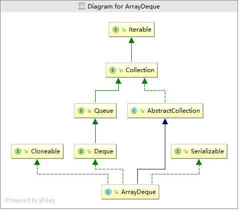

# ArrayDeque

## 简介

ArrayDeque类是Deque接口的一种实现，它表示一个双端队列。Deque接口除了提供操作双端队列的一系列方法之外，还提供了操作栈的方法，因此ArrayDeque也可以表示一个栈。LinkedList类也是Deque接口的一种实现，它是基于双向链表实现的。ArrayDeque是基于数组实现的，当数组容量不足时，会对数组进行扩容。ArrayDeque与LinkedList一样，都是非线程安全的。

## 继承体系



通过继承体系可以看，ArrayDeque实现了Deque接口，Deque接口继承自Queue接口，它是对Queue的一种增强 

```java

    void addFirst(E e);//添加元素到队列头
    void addLast(E e);//添加元素到队列尾
    boolean offerFirst(E e);//添加元素到队列头
    boolean offerLast(E e);//添加元素到队列尾
    E removeFirst();//从队列头移除元素
    E removeLast();//从队列尾移除元素
    E pollFirst();////从队列头移除元素
    E pollLast();//从队列尾移除元素
    E getFirst();//查看队列头元素
    E getLast();//查看队列尾元素
    E peekFirst();//查看队列头元素
    E peekLast();//查看队列尾元素
    boolean removeFirstOccurrence(Object o);//从队列头遍历移除指定元素
    boolean removeLastOccurrence(Object o);//从队列尾遍历移除指定元素
  //******队列中的方法******
	boolean add(E e);//添加元素， 等于addLast
    boolean offer(E e);//添加元素， 等于offerLast
    E remove();//移除元素
    E poll();//移除元素
    E element();//查看元素
    E peek();//查看元素
//******栈方法******
    void push(E e);//入栈
    E pop();//出栈
//******Collection中的方法******
    boolean remove(Object o);//删除指定元素
    boolean contains(Object o);//检查是否包含某个元素
    public int size();//元素个数
    Iterator<E> iterator();//迭代器
    Iterator<E> descendingIterator();//反向迭代器
```

### 源码分析

#### 属性

```java
transient Object[] elements; // 存储元素的数组
transient int head;//队列头位置
transient int tail;//队列尾位置
private static final int MIN_INITIAL_CAPACITY = 8;//最小初始化位置
```

#### 构造方法

```java
//默认构造初始化容量为16
public ArrayDeque() {
    elements = new Object[16];
}

//指定初始化元素的个数
public ArrayDeque(int numElements) {
    allocateElements(numElements);
}

//将集合c中的元素初始化到数组中
public ArrayDeque(Collection<? extends E> c) {
    allocateElements(c.size());
    addAll(c);
}
//计算容量
  private void allocateElements(int numElements) {
        int initialCapacity = MIN_INITIAL_CAPACITY;
        //计算容量，这段代码的逻辑是算出大于numElements的最接近的2的n次方且不小于8
        if (numElements >= initialCapacity) {
            initialCapacity = numElements;
            initialCapacity |= (initialCapacity >>>  1);
            initialCapacity |= (initialCapacity >>>  2);
            initialCapacity |= (initialCapacity >>>  4);
            initialCapacity |= (initialCapacity >>>  8);
            initialCapacity |= (initialCapacity >>> 16);
            initialCapacity++;

            if (initialCapacity < 0)   // Too many elements, must back off
                initialCapacity >>>= 1;// Good luck allocating 2 ^ 30 elements
        }
        elements = new Object[initialCapacity];
    }
```
#### 入队

```java
public void addFirst(E e) {//从队列头入队
    if (e == null)//不能为空
        throw new NullPointerException();
    //头指针从右往左移 
    elements[head = (head - 1) & (elements.length - 1)] = e;
    if (head == tail)
        //扩容
        doubleCapacity();
}
//从队列尾入队
  public void addLast(E e) {
        if (e == null)
            throw new NullPointerException();
        elements[tail] = e;
      //tail指针加1，如果到数组尾了就从头开始
        if ( (tail = (tail + 1) & (elements.length - 1)) == head)
            doubleCapacity();  //扩容
    }
```

#### 扩容

```java
private void doubleCapacity() {
    assert head == tail;
    int p = head;//头指针
    int n = elements.length;//就数组长度
    int r = n - p; // 头指针到尾指针的距离
    int newCapacity = n << 1;//新长度为旧长度的两倍
    if (newCapacity < 0)
        throw new IllegalStateException("Sorry, deque too big");
    Object[] a = new Object[newCapacity];
    //将旧数组head之后的元素拷贝到新数组中
    System.arraycopy(elements, p, a, 0, r);
    //将旧数组下标0到head之间的元素拷贝到新数组中
    System.arraycopy(elements, 0, a, r, p);
    elements = a;
    // head指向0，tail指向旧数组长度表示的位置
    head = 0;
    tail = n;
}
```

#### 出队

head 指向的位置是有数据的，tail指向的位置是没有数据

```java
public E pollFirst() {
    int h = head;
    @SuppressWarnings("unchecked")
    E result = (E) elements[h];
    // 取队列头位置
    if (result == null)
        return null;
    elements[h] = null;     
    head = (h + 1) & (elements.length - 1);//头位置后移一位
    return result;
}

public E pollLast() {
    int t = (tail - 1) & (elements.length - 1);//尾指针左边一位的位置
    @SuppressWarnings("unchecked")
    E result = (E) elements[t];//要出队的数据
    if (result == null)
        return null;
    elements[t] = null;
    tail = t;//尾指针左边一位的位置设置为尾指针的位置
    return result;
}
```