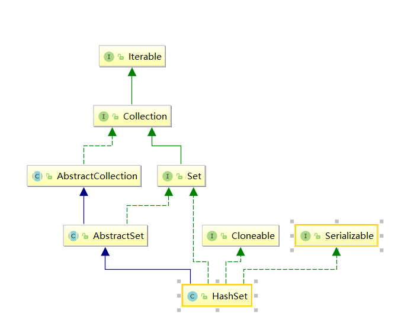

# 
HashSet

## 简介

①：实现了Serializable接口，表明它支持序列化。 
②：实现了Cloneable接口，表明它支持克隆，可以调用超类的clone（）方法进行浅拷贝。 
③继承了AbstractSet抽象类，和ArrayList和LinkedList一样，在他们的抽象父类中，都提供了equals（）方法和hashCode（）方法。它们自身并不实现这两个方法，（但是ArrayList和LinkedList的equals（）实现不同。你可以看我的关于ArrayList这一块的源码解析）这就意味着诸如和HashSet一样继承自AbstractSet抽象类的TreeSet、LinkedHashSet等，他们只要元素的个数和集合中元素相同，即使他们是AbstractSet不同的子类，他们equals（）相互比较的后的结果仍然是true

