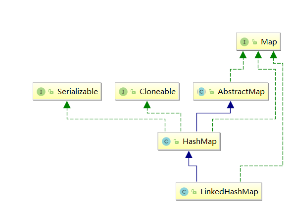

# <center>LinkedHashMap</center>

### 简介

LinkedHashMap 继承自 HashMap，在 HashMap 基础上，通过维护一条双向链表，解决了 HashMap 不能随时保持遍历顺序和插入顺序一致的问题。除此之外，LinkedHashMap 对访问顺序也提供了相关支持。在一些场景下，该特性很有用，比如缓存。在实现上，LinkedHashMap 很多方法直接继承自 HashMap，仅为维护双向链表覆写了部分方法 。

### 继承关系



### 源码解析

#### 属性


```java
//双向链表头结点
transient LinkedHashMap.Entry<K,V> head;
//尾节点
transient LinkedHashMap.Entry<K,V> tail;

//是否按顺序排序 false 按插入输入存储元素 true 按访问顺序存储元素
final boolean accessOrder;
```

#### 内部类

存储数据的节点，next用于单链表存储于桶中，before和after用于双向链表存储所有元素 

```
static class Entry<K,V> extends HashMap.Node<K,V> {
    Entry<K,V> before, after;
    Entry(int hash, K key, V value, Node<K,V> next) {
        super(hash, key, value, next);
    }
}
 static class Node<K,V> implements Map.Entry<K,V> {
        final int hash;
        final K key;
        V value;
        Node<K,V> next;

```

#### 构造方法

前四个默认accessOrder为false双向链表按插入顺序存储元素，最后一个传入true时按访问顺序存储元素，这也是实现RLU缓存策略的关键。

```java
public LinkedHashMap(int initialCapacity, float loadFactor) {
    super(initialCapacity, loadFactor);
    accessOrder = false;
}


public LinkedHashMap(int initialCapacity) {
    super(initialCapacity);
    accessOrder = false;
}

public LinkedHashMap() {
    super();
    accessOrder = false;
}


public LinkedHashMap(Map<? extends K, ? extends V> m) {
    super();
    accessOrder = false;
    putMapEntries(m, false);
}


public LinkedHashMap(int initialCapacity,
                     float loadFactor,
                     boolean accessOrder) {
    super(initialCapacity, loadFactor);
    this.accessOrder = accessOrder;
}
```

#### 常见方法

##### afterNodeInsertion

```java
void afterNodeInsertion(boolean evict) { // possibly remove eldest
    LinkedHashMap.Entry<K,V> first;
    //根据条件判断是否移除最近最少被访问的节点
    if (evict && (first = head) != null && removeEldestEntry(first)) {
        
        K key = first.key;
        removeNode(hash(key), key, null, false, true);
    }
}
//通过覆写removeEldestEntry方法可以实现自定义策略的 LRU 缓存
protected boolean removeEldestEntry(Map.Entry<K,V> eldest) {
        return false;
    }
```

##### afterNodeAccess

在节点访问之后被调用，主要在put()已经存在的元素或get()时被调用，如果accessOrder为true，调用这个方法把访问到的节点移动到双向链表的末尾 

```java
void afterNodeAccess(Node<K,V> e) { // move node to last
    LinkedHashMap.Entry<K,V> last;
    if (accessOrder && (last = tail) != e) {
        LinkedHashMap.Entry<K,V> p =
            (LinkedHashMap.Entry<K,V>)e, b = p.before, a = p.after;
        p.after = null;//从双向列表移除
        if (b == null)
            head = a;
        else
            b.after = a;
        if (a != null)
            a.before = b;
        else
            last = b;
            // 把p节点放到双向链表的末尾
        if (last == null)
            head = p;
        else {
            p.before = last;
            last.after = p;
        }
        tail = p;
        ++modCount;
    }
}
```

##### afterNodeRemoval


```java
void afterNodeRemoval(Node<K,V> e) { // unlink
    LinkedHashMap.Entry<K,V> p =
        (LinkedHashMap.Entry<K,V>)e, b = p.before, a = p.after;
    p.before = p.after = null;//把节点p从双向链表中删除。
    if (b == null)
        head = a;
    else
        b.after = a;
    if (a == null)
        tail = b;
    else
        a.before = b;
}
```