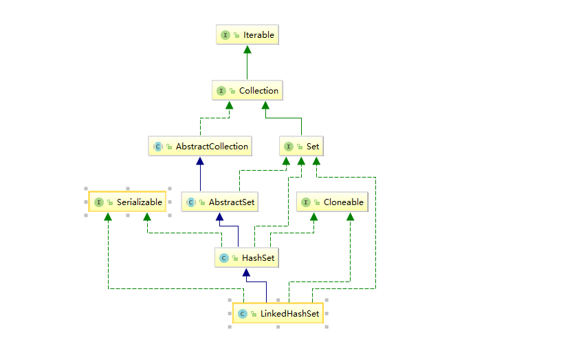

# <center>LinkedHashSet</center>

## 简介



## 源码解析

```java
public LinkedHashSet(int initialCapacity, float loadFactor) {
    super(initialCapacity, loadFactor, true);
}


public LinkedHashSet(int initialCapacity) {
    super(initialCapacity, .75f, true);
}


public LinkedHashSet() {
    super(16, .75f, true);
}

public LinkedHashSet(Collection<? extends E> c) {
    super(Math.max(2*c.size(), 11), .75f, true);
    addAll(c);
}


@Override//可分割的迭代器, 主要用于多线程并行迭代处理时使用
public Spliterator<E> spliterator() {
    return Spliterators.spliterator(this, Spliterator.DISTINCT | Spliterator.ORDERED);
}
```

LinkedHashSet用LinkedHashMap存储元素因此是有序的

```java
public LinkedHashMap(int initialCapacity, float loadFactor) {
    super(initialCapacity, loadFactor);
    accessOrder = false;//写死false LinkedHashSet是不支持按访问顺序对元素排序的，只能按插入顺序排序
}
```