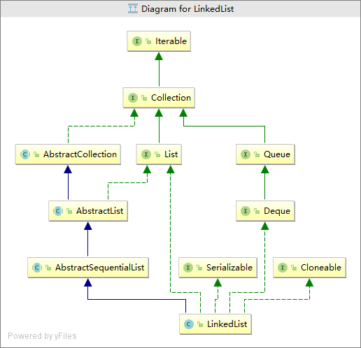

# LinkedList

## 概述

通过类名可以想象到, 该类的结构是一个链表结构.
但是它是一个类似于数组的链表, 意思就是普通的添加操作与数组类似, 将新元素添加到链表的尾端. 并支持通过下标来进行访问.
它实现了Deque接口, 提供了栈和队列的操作, 也就是该类的主要功能吧.
对于元素的增删改比ArrayList强; 对于元素的查询不如ArrayList.

## 继承体系



从图中我们可以看出：

继承了AbstractSequentialList抽象类：在遍历LinkedList的时候，官方更推荐使用顺序访问，也就是使用我们的迭代器。（因为LinkedList底层是通过一个链表来实现的）（虽然LinkedList也提供了get（int index）方法，但是底层的实现是：每次调用get（int index）方法的时候，都需要从链表的头部或者尾部进行遍历，每一的遍历时间复杂度是O(index)，而相对比ArrayList的底层实现，每次遍历的时间复杂度都是O(1)。所以不推荐通过get（int index）遍历LinkedList。至于上面的说从链表的头部后尾部进行遍历：官方源码对遍历进行了优化：通过判断索引index更靠近链表的头部还是尾部来选择遍历的方向）（所以这里遍历LinkedList推荐使用迭代器）。
实现了List接口。（提供List接口中所有方法的实现）
实现了Cloneable接口，它支持克隆（浅克隆），底层实现：LinkedList节点并没有被克隆，只是通过Object的clone（）方法得到的Object对象强制转化为了LinkedList,然后把它内部的实例域都置空，然后把被拷贝的LinkedList节点中的每一个值都拷贝到clone中。（后面有源码解析）
实现了Deque接口。实现了Deque所有的可选的操作。
实现了Serializable接口。表明它支持序列化。（和ArrayList一样，底层都提供了两个方法：readObject（ObjectInputStream o）、writeObject（ObjectOutputStream o），用于实现序列化，底层只序列化节点的个数和节点的值）。

## 源码分析

### 属性

```java
//元素个数
transient int size = 0;
//链表首节点
transient Node<E> first;
//链表尾节点
transient Node<E> last;
```

### 主要内部类

双向链表

```java
private static class Node<E> {
    E item;
    Node<E> next;
    Node<E> prev;

    Node(Node<E> prev, E element, Node<E> next) {
        this.item = element;
        this.next = next;
        this.prev = prev;
    }
}
```

### 构造方法

无界队列

```java
public LinkedList() {
}
public LinkedList(Collection<? extends E> c) {
    this();
    addAll(c);
}
```

### 其他方法

#### 添加元素


#### 删除元素


## 总结

   (1）LinkedList是一个以双链表实现的List；

（2）LinkedList还是一个双端队列，具有队列、双端队列、栈的特性；

（3）LinkedList在队列首尾添加、删除元素非常高效，时间复杂度为O(1)；

（4）LinkedList在中间添加、删除元素比较低效，时间复杂度为O(n)；

（5）LinkedList不支持随机访问，所以访问非队列首尾的元素比较低效；

（6）LinkedList在功能上等于ArrayList + ArrayDeque；

（7）基于链表结构的存储方式, 随机访问性能差, 元素的增删性能比较好.

（8）没有扩容操作, 同等元素的情况下, 占用内存比ArrayList多, 因为还要存储节点之间的引用.

（9）可以作为栈或者队列使用.


## 参考

[LinkedList源码分析](https://www.imooc.com/article/78970)

[LinkedList源码解析（基于JDK1.8）](https://www.baidu.com/s?ie=UTF-8&wd=LinkedList%E6%BA%90%E7%A0%81%E8%A7%A3%E6%9E%90 )

[死磕 java集合之LinkedList源码分析](https://mp.weixin.qq.com/s?__biz=Mzg2ODA0ODM0Nw==&mid=2247483855&idx=1&sn=57a57f553ff14d71b77e4982c7e04cdd&scene=21#wechat_redirect )