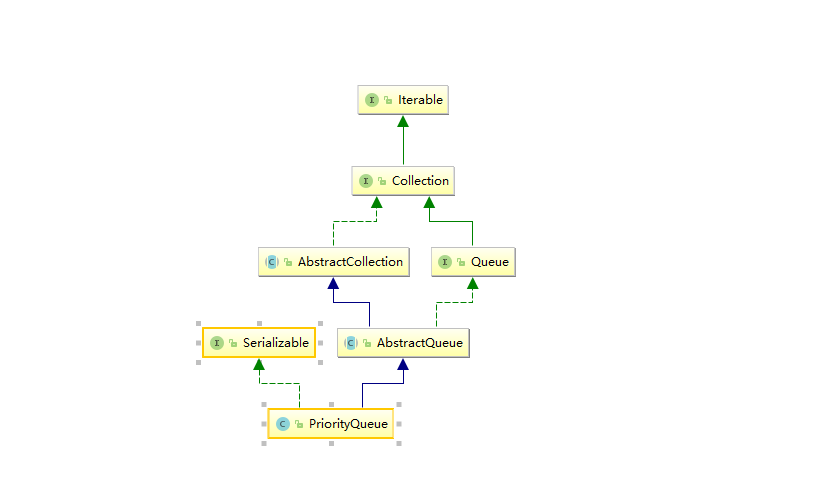

# <center>PriorityQueue</center>

## 简介




优先级队列，是0个或多个元素的集合，集合中的每个元素都有一个权重值，每次出队都弹出优先级最大或最小的元素。

一般来说，优先级队列使用堆来实现.堆的两个特性，即：

（1）堆是一颗完全二叉树；

（2）堆中某个节点的值总是不大于（或不小于）其父节点的值。

完全二叉树是指除了最后一层其它层都达到最大节点数，且最后一层节点都靠左排列 

PriorityQueue是一个小顶堆,非线程安全的,不是有序的，只有堆顶存储着最小的元素 

## 源码分析

### 属性

```java
//默认容量
private static final int DEFAULT_INITIAL_CAPACITY = 11;
//存放元素
transient Object[] queue; // non-private to simplify nested class access
//元素个数
private int size = 0;
//比较器
//在优先级队列中，也有两种方式比较元素，一种是元素的自然顺序，一种是通过比较器来比较；
private final Comparator<? super E> comparator;
//修改次数 有这个属性表示PriorityQueue也是fast-fail的
transient int modCount = 0; // non-private to simplify nested class access
```
### 构造方法

```java
public PriorityQueue() {//默认容量
    this(DEFAULT_INITIAL_CAPACITY, null);
}

//传入初始化容量
public PriorityQueue(int initialCapacity) {
    this(initialCapacity, null);
}

//传入比较器
public PriorityQueue(Comparator<? super E> comparator) {
    this(DEFAULT_INITIAL_CAPACITY, comparator);
}

//传入初始容量 比较器
public PriorityQueue(int initialCapacity,
                     Comparator<? super E> comparator) {
   
    if (initialCapacity < 1)
        throw new IllegalArgumentException();
    this.queue = new Object[initialCapacity];
    this.comparator = comparator;
}

//传入一个集合 包含下面两个方法
@SuppressWarnings("unchecked")
public PriorityQueue(Collection<? extends E> c) {
    if (c instanceof SortedSet<?>) {
        
        SortedSet<? extends E> ss = (SortedSet<? extends E>) c;
        this.comparator = (Comparator<? super E>) ss.comparator();
        initElementsFromCollection(ss);
    }
    else if (c instanceof PriorityQueue<?>) {
        PriorityQueue<? extends E> pq = (PriorityQueue<? extends E>) c;
        this.comparator = (Comparator<? super E>) pq.comparator();
        initFromPriorityQueue(pq);
    }
    else {
        this.comparator = null;
        initFromCollection(c);
    }
}


@SuppressWarnings("unchecked")
public PriorityQueue(PriorityQueue<? extends E> c) {
    this.comparator = (Comparator<? super E>) c.comparator();
    initFromPriorityQueue(c);
}


@SuppressWarnings("unchecked")
public PriorityQueue(SortedSet<? extends E> c) {
    this.comparator = (Comparator<? super E>) c.comparator();
    initElementsFromCollection(c);
}
```
### 入队

```java
public boolean add(E e) {
    return offer(e);
}


public boolean offer(E e) {
    if (e == null)
        throw new NullPointerException();
    modCount++;
    int i = size;
    if (i >= queue.length)
        grow(i + 1);//扩容
    size = i + 1;
    if (i == 0)
        //如果没有元素直接插入到数组0位置
        queue[0] = e;
    else
        //否则，插入元素到数组size的位置，也就是最后一个元素的下一位
        siftUp(i, e);
    return true;
}
private void siftUp(int k, E x) {
    //根据是否有比较器，调用不同的方法
        if (comparator != null)
            siftUpUsingComparator(k, x);
        else
            siftUpComparable(k, x);
    }
//自下而上堆化
private void siftUpComparable(int k, E x) {
        Comparable<? super E> key = (Comparable<? super E>) x;
        while (k > 0) {
           //找到父节点的位置
            int parent = (k - 1) >>> 1;
            //父节点的值
            Object e = queue[parent];
            //比较插入元素与父节点的值。如果比父节点大跳出循环
            if (key.compareTo((E) e) >= 0)
                break;
            //与父节点交换位置
            queue[k] = e;
            //现在插入的元素位置移到了父节点的位置,继续与父节点再比较
            k = parent;
        }
    // 最后找到应该插入的位置，放入元素
        queue[k] = key;
    }
```

###  扩容

```java
private void grow(int minCapacity) {
    //旧容量
    int oldCapacity = queue.length;
    // 旧容量小于64时，容量翻倍，大于等于64时容量增加旧容量的一半
    int newCapacity = oldCapacity + ((oldCapacity < 64) ?
                                     (oldCapacity + 2) :
                                     (oldCapacity >> 1));
    // 检查是否溢出
    if (newCapacity - MAX_ARRAY_SIZE > 0)
        newCapacity = hugeCapacity(minCapacity);
    //创建出一个新容量大小的新数组并把旧数组元素拷贝过去
    queue = Arrays.copyOf(queue, newCapacity);
}

private static int hugeCapacity(int minCapacity) {
    if (minCapacity < 0) // overflow
        throw new OutOfMemoryError();
    return (minCapacity > MAX_ARRAY_SIZE) ?
        Integer.MAX_VALUE :
        MAX_ARRAY_SIZE;
}
```

### 出队

```java
//java.util.AbstractQueue#remove
public E remove() {
    //弹出队首元素
    E x = poll();
    if (x != null)
        return x;//返回弹出的元素
    else
        throw new NoSuchElementException();
}

public E poll() {
        if (size == 0)
            return null;//没有元素
        int s = --size;//元素个数-1
        modCount++;//修改次数+1
        E result = (E) queue[0];//队首元素
        E x = (E) queue[s];//队末元素
        queue[s] = null;//将队末元素置空
        if (s != 0)
            //如果删除后元素的个数不为空，将队列末元素移到队列首，需要自顶而下堆化
            siftDown(0, x);
        return result;//返回弹出的元素
    }

private void siftDown(int k, E x) {
        if (comparator != null)//根据是否有比较器，选择不同的方法
            siftDownUsingComparator(k, x);
        else
            siftDownComparable(k, x);
    }

    @SuppressWarnings("unchecked")
    private void siftDownComparable(int k, E x) {
        Comparable<? super E> key = (Comparable<? super E>)x;
        int half = size >>> 1;        //只需要比较一半就行了，因为叶子节点占了一半的元素
        while (k < half) {
            int child = (k << 1) + 1; // 寻找子节点的位置，这里加1是因为元素从0号位置开始
            Object c = queue[child];//左子节点
            int right = child + 1;//右子节点位置
            if (right < size &&
                ((Comparable<? super E>) c).compareTo((E) queue[right]) > 0)
                c = queue[child = right];//左右节点取其小者
            if (key.compareTo((E) c) <= 0)
                // 如果比子节点都小，则结束
                break;
            queue[k] = c;// 如果比最小的子节点大，则交换位置
            k = child;//指针移到最小子节点的位置继续往下比较
        }
        queue[k] = key;
    }
```