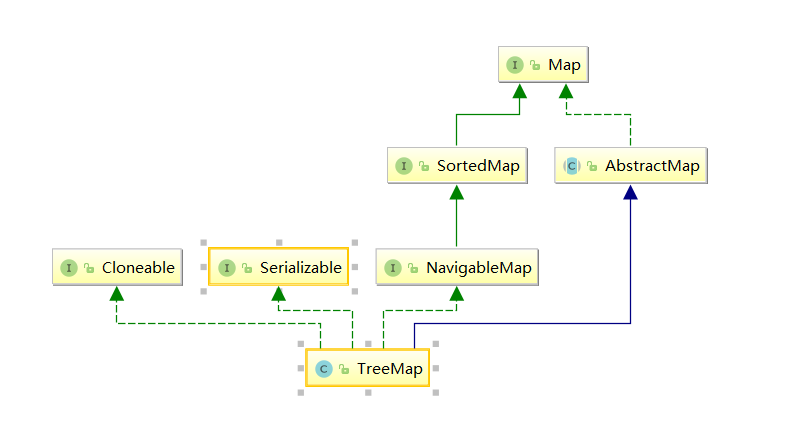

#  <center></center>

## 简介

TreeMap实现了SotredMap接口，它是有序的集合。而且是一个红黑树结构，每个key-value都作为一个红黑树的节点。如果在调用TreeMap的构造函数时没有指定比较器，则根据key执行自然排序。这点会在接下来的代码中做说明，如果指定了比较器则按照比较器来进行排序。

 ## 继承体系



 ## SortedMap

SortedMap规定了元素可以按key的大小来遍历，它定义了一些返回部分map的方法。 

 ```java
public interface SortedMap<K,V> extends Map<K,V> {
    //key的比较器
    Comparator<? super K> comparator();
    //返回formKey（包含）到ToKey（不包含）的子map
    SortedMap<K,V> subMap(K fromKey, K toKey);
// 返回小于toKey（不包含）的子map
    SortedMap<K,V> headMap(K toKey);
  // 返回小于等于formKey（包含）的子map
    SortedMap<K,V> tailMap(K fromKey);
//返回最小的Key
    K firstKey();
//返回最大的Key
    K lastKey();
//返回key集合
    Set<K> keySet();
//返回value集合
    Collection<V> values();
// 返回节点集合
    Set<Map.Entry<K, V>> entrySet();
}
 ```

## NavigableMap

NavigableMap是对SortedMap的增强，定义了一些返回离目标key最近的元素的方法。

```java
// 小于给定的Key的最大节点
Map.Entry<K,V> lowerEntry(K key);
//小于给定的Key的最大Key
    K lowerKey(K key);
//小于等于给定的Key的最大节点
Map.Entry<K,V> floorEntry(K key);
//小于等于给定的Key的最大Key
  K floorKey(K key);
//大于等于给定key的最小节点
 Map.Entry<K,V> ceilingEntry(K key);
//大于等于给定key的最小key
 K ceilingKey(K key);
// 大于给定的最小节点
 Map.Entry<K,V> higherEntry(K key);
//大于给定的最小key
  K higherKey(K key);
// 最小节点
Map.Entry<K,V> firstEntry();
//最大的节点
    Map.Entry<K,V> lastEntry();
//弹出最小的节点
 Map.Entry<K,V> pollFirstEntry();
//弹出最大的节点
    Map.Entry<K,V> pollLastEntry();
//返回倒叙的map
NavigableMap<K,V> descendingMap();
//返回有序的key集合
 NavigableSet<K> navigableKeySet();
//返回倒序的key集合
NavigableSet<K> descendingKeySet();
//返回小于toKey的子map，是否包含toKey自己决定
    NavigableMap<K,V> headMap(K toKey, boolean inclusive);
//返回从fromKey到toKey的子map，是否包含起止元素可以自己决定
 NavigableMap<K,V> subMap(K fromKey, boolean fromInclusive,
                             K toKey,   boolean toInclusive);
//返回大于fromKey的子map，是否包含fromKey自己决定
  NavigableMap<K,V> tailMap(K fromKey, boolean inclusive);
//等价于subMap(fromKey, true, toKey, false)
 SortedMap<K,V> subMap(K fromKey, K toKey);
//等价于headMap(toKey, false)
    SortedMap<K,V> headMap(K toKey); 
// 等价于tailMap(fromKey, true)
    SortedMap<K,V> tailMap(K fromKey);
```

 ## 源码分析

### 属性

```java
//比较器 没传则key需要实现Comparator接口
private final Comparator接口<? super K> comparator;
//根节点
private transient Entry<K,V> root;

//元素个数
private transient int size =   0;

//修改次数
private transient int modCount = 0;
```

### 内部类

存储节点

```java
static final class Entry<K,V> implements Map.Entry<K,V> {
    K key;
    V value;
    Entry<K,V> left;
    Entry<K,V> right;
    Entry<K,V> parent;
    boolean color = BLACK;
}
```

### 构造方法

```java
public TreeMap() {
    comparator = null;//默认构造器 key必须实现comparable接口
}


public TreeMap(Comparator<? super K> comparator) {
    this.comparator = comparator;//根据传入的比较器比较key的大小
}

//key必须实现Comparable接口，把传入map中的所有元素保存到新的TreeMap中 
public TreeMap(Map<? extends K, ? extends V> m) {
    comparator = null;
    putAll(m);
}

//使用传入map的比较器，并把传入map中的所有元素保存到新的TreeMap中 
public TreeMap(SortedMap<K, ? extends V> m) {
    comparator = m.comparator();
    try {
        buildFromSorted(m.size(), m.entrySet().iterator(), null, null);
    } catch (java.io.IOException cannotHappen) {
    } catch (ClassNotFoundException cannotHappen) {
    }
}
```

### get(Object key)


```java
public V get(Object key) {
    Entry<K,V> p = getEntry(key);
    return (p==null ? null : p.value);
}
final Entry<K,V> getEntry(Object key) {
        // 如果comparator不为空，使用comparator的版本获取元素
        if (comparator != null)
            return getEntryUsingComparator(key);
        if (key == null)
            throw new NullPointerException();
        @SuppressWarnings("unchecked")
    //将key转为Comparable
            Comparable<? super K> k = (Comparable<? super K>) key;
        Entry<K,V> p = root;
        while (p != null) {
            //遍历
            int cmp = k.compareTo(p.key);
            if (cmp < 0)
                p = p.left;
            else if (cmp > 0)
                p = p.right;
            else
                return p;
        }
        return null;
    }
 final Entry<K,V> getEntryUsingComparator(Object key) {
        @SuppressWarnings("unchecked")
            K k = (K) key;
        Comparator<? super K> cpr = comparator;
        if (cpr != null) {
            Entry<K,V> p = root;
            while (p != null) {//从根元素开始遍历
                int cmp = cpr.compare(k, p.key);
                if (cmp < 0)
                    //小于0从左子树查找
                    p = p.left;
                else if (cmp > 0)
                    //大于0则从柚子树查找
                    p = p.right;
                else
                    //查到返回
                    return p;
            }
        }
        return null;
    }
```

### rotateLeft(Entry<K,V> p)

左旋

```java
private void rotateLeft(Entry<K,V> p) {//以P节点为支点左旋
    if (p != null) {
        //p的右节点 r
        Entry<K,V> r = p.right;
        //将r的左节点设置为p的右节点
        p.right = r.left;
        
        if (r.left != null)
            //如果r的左节点存在，将p节点设置为r左节点的父节点
            r.left.parent = p;
        //将P节点设置为R节点的父节点
        r.parent = p.parent;
        if (p.parent == null)
          //  如果p节点的父亲为空，则将r节点设置为根节点
            root = r;
        else if (p.parent.left == p)
            //如果p节点是他父亲的做节点，则将r节点设置为p节点父亲的左节点
            p.parent.left = r;
        else
            //如果p节点是他父亲的右节点，则将r节点设置为p节点父亲的右节点
            p.parent.right = r;
        r.left = p;//将p节点设置为r的左节点
        p.parent = r;将r设置为p的父节点
    }
}
```

### rotateRight(Entry<K,V> p)

右旋

```java
private void rotateRight(Entry<K,V> p) {
    if (p != null) {
    //p的左节点l
        Entry<K,V> l = p.left;
        //将l的右节点设置为p的左节点
        p.left = l.right;
        //如果l的右节点不为空，则将p节点设置l右节点的父节点
        if (l.right != null) l.right.parent = p;
        //p的父节点设置为l的父节点
        l.parent = p.parent;
       
        if (p.parent == null)
             //如果p的父节点为空，则将l节点设置为根节点
            root = l;
        else if (p.parent.right == p)
            //如果p节点是p父节点的右右节点则将l节点设置p父节点的右节点
            p.parent.right = l;
        //如果p节点是p父节点的左节点设置p父节点的左节点
        else p.parent.left = l;
        //将p节点设置为l的的右节点
        l.right = p;
        //将l设置为p的父节点
        p.parent = l;
    }
}
```
### put(K key, V value)

```java
public V put(K key, V value) {
    Entry<K,V> t = root;
    if (t == null) {//判断根节点
        //检查是否为空
        compare(key, key); // type (and possibly null) check
//插入根节点
        root = new Entry<>(key, value, null);
        size = 1;
        modCount++;
        return null;
    }
    int cmp;//存储key的比较结果
    Entry<K,V> parent;
    // split comparator and comparable paths
    Comparator<? super K> cpr = comparator;
    if (cpr != null) {
        //比较器不为空
        do {
            parent = t;//从根节点开始遍历
            cmp = cpr.compare(key, t.key);
            if (cmp < 0)
                //传入的key比父节点小从左子树查
                t = t.left;
            else if (cmp > 0)
 //传入的key比父节点大从右子树查
                t = t.right;
            else
                //找到了就将值设置
                return t.setValue(value);
        } while (t != null);
    }
    else {
        //比较器为空 key为空则抛出异常
        if (key == null)
            throw new NullPointerException();
        @SuppressWarnings("unchecked")
        //将key强转为比较器
            Comparable<? super K> k = (Comparable<? super K>) key;
        do {
            //从根节点开始遍历
            parent = t;
            cmp = k.compareTo(t.key);
            if (cmp < 0)
                t = t.left;
            else if (cmp > 0)
                t = t.right;
            else
                return t.setValue(value);
        } while (t != null);
    }
    // 如果没找到，那么新建一个节点，并插入到树中
    Entry<K,V> e = new Entry<>(key, value, parent);
    if (cmp < 0)
        //小于插入到左子节点
        parent.left = e;
    else
        //大于插入到右子节点
        parent.right = e;
    //平衡
    fixAfterInsertion(e);
    size++;
    modCount++;
    return null;
}
```

### fixAfterInsertion(Entry<K,V> x) 

```
private void fixAfterInsertion(Entry<K,V> x) {
    x.color = RED;

    while (x != null && x != root && x.parent.color == RED) {
        if (parentOf(x) == leftOf(parentOf(parentOf(x)))) {
            Entry<K,V> y = rightOf(parentOf(parentOf(x)));
            if (colorOf(y) == RED) {
                setColor(parentOf(x), BLACK);
                setColor(y, BLACK);
                setColor(parentOf(parentOf(x)), RED);
                x = parentOf(parentOf(x));
            } else {
                if (x == rightOf(parentOf(x))) {
                    x = parentOf(x);
                    rotateLeft(x);
                }
                setColor(parentOf(x), BLACK);
                setColor(parentOf(parentOf(x)), RED);
                rotateRight(parentOf(parentOf(x)));
            }
        } else {
            Entry<K,V> y = leftOf(parentOf(parentOf(x)));
            if (colorOf(y) == RED) {
                setColor(parentOf(x), BLACK);
                setColor(y, BLACK);
                setColor(parentOf(parentOf(x)), RED);
                x = parentOf(parentOf(x));
            } else {
                if (x == leftOf(parentOf(x))) {
                    x = parentOf(x);
                    rotateRight(x);
                }
                setColor(parentOf(x), BLACK);
                setColor(parentOf(parentOf(x)), RED);
                rotateLeft(parentOf(parentOf(x)));
            }
        }
    }
    root.color = BLACK;
}
```