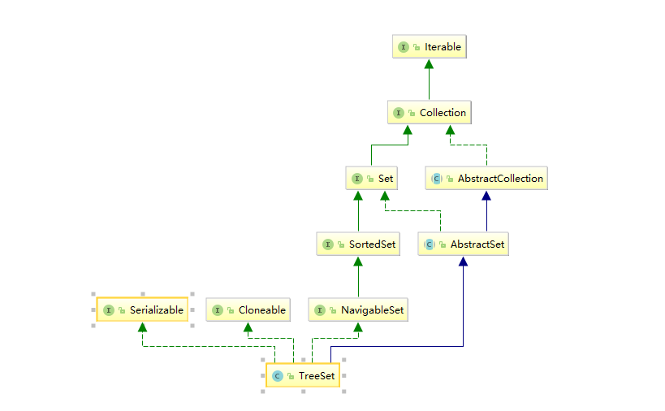

# <center>TreeSet</center>

## 简介

TreeSet底层是采用TreeMap实现的一种Set，所以它是有序的，同样也是非线程安全的 



## 源码解析

源码比较简单，基本都是调用map相应的方法 

```java
public class TreeSet<E> extends AbstractSet<E>
//实现了 NavigableSet所以是有序的
    implements NavigableSet<E>, Cloneable, java.io.Serializable
{
    //元素存在NavigableMap中
    private transient NavigableMap<E,Object> m;

    // 虚拟元素，用来作为value存储在map中
    private static final Object PRESENT = new Object();
//只能被同包调用
    TreeSet(NavigableMap<E,Object> m) {
        this.m = m;
    }

 //使用TreeMap初始化 key必须实现comparator
    public TreeSet() {
        this(new TreeMap<E,Object>());
    }

  //使用自带的comparator完成初始化
    public TreeSet(Comparator<? super E> comparator) {
        this(new TreeMap<>(comparator));
    }
//将集合c中的所有元素添加的TreeSet中
    public TreeSet(Collection<? extends E> c) {
        this();
        addAll(c);
    }

   //将SortedSet中的所有元素添加到TreeSet中
    public TreeSet(SortedSet<E> s) {
        this(s.comparator());
        addAll(s);
    }

    //迭代器
    public Iterator<E> iterator() {
        return m.navigableKeySet().iterator();
    }

//逆序迭代器
    public Iterator<E> descendingIterator() {
        return m.descendingKeySet().iterator();
    }

   //以逆序返回一个新的TreeSet
    public NavigableSet<E> descendingSet() {
        return new TreeSet<>(m.descendingMap());
    }

    //返回元素个数
    public int size() {
        return m.size();
    }

    //判断元素是否为空
    public boolean isEmpty() {
        return m.isEmpty();
    }

   //判断是否包含某个元素
    public boolean contains(Object o) {
        return m.containsKey(o);
    }

   // 添加元素, 调用map的put()方法, value为PRESENT
    public boolean add(E e) {
        return m.put(e, PRESENT)==null;
    }

   //删除元素
    public boolean remove(Object o) {
        return m.remove(o)==PRESENT;
    }

    //清空元素
    public void clear() {
        m.clear();
    }

    //添加集合c中的所有元素
    public  boolean addAll(Collection<? extends E> c) {
        // 满足一定条件时直接调用TreeMap的addAllForTreeSet()方法添加元素
        if (m.size()==0 && c.size() > 0 &&
            c instanceof SortedSet &&
            m instanceof TreeMap) {
            SortedSet<? extends E> set = (SortedSet<? extends E>) c;
            TreeMap<E,Object> map = (TreeMap<E, Object>) m;
            Comparator<?> cc = set.comparator();
            Comparator<? super E> mc = map.comparator();
            if (cc==mc || (cc != null && cc.equals(mc))) {
                map.addAllForTreeSet(set, PRESENT);
                return true;
            }
        }
        //不满足上述条件, 调用父类的addAll()通过遍历的方式一个一个地添加元素
        return super.addAll(c);
    }

    //子set（NavigableSet中的方法）
    public NavigableSet<E> subSet(E fromElement, boolean fromInclusive,
                                  E toElement,   boolean toInclusive) {
        return new TreeSet<>(m.subMap(fromElement, fromInclusive,
                                       toElement,   toInclusive));
    }

   //头set（NavigableSet中的方法）
    public NavigableSet<E> headSet(E toElement, boolean inclusive) {
        return new TreeSet<>(m.headMap(toElement, inclusive));
    }

    /**
     * @throws ClassCastException {@inheritDoc}
     * @throws NullPointerException if {@code fromElement} is null and
     *         this set uses natural ordering, or its comparator does
     *         not permit null elements
     * @throws IllegalArgumentException {@inheritDoc}
     * @since 1.6
     */
    public NavigableSet<E> tailSet(E fromElement, boolean inclusive) {
        return new TreeSet<>(m.tailMap(fromElement, inclusive));
    }

    /**
     * @throws ClassCastException {@inheritDoc}
     * @throws NullPointerException if {@code fromElement} or
     *         {@code toElement} is null and this set uses natural ordering,
     *         or its comparator does not permit null elements
     * @throws IllegalArgumentException {@inheritDoc}
     */
    public SortedSet<E> subSet(E fromElement, E toElement) {
        return subSet(fromElement, true, toElement, false);
    }

    /**
     * @throws ClassCastException {@inheritDoc}
     * @throws NullPointerException if {@code toElement} is null
     *         and this set uses natural ordering, or its comparator does
     *         not permit null elements
     * @throws IllegalArgumentException {@inheritDoc}
     */
    public SortedSet<E> headSet(E toElement) {
        return headSet(toElement, false);
    }

    /**
     * @throws ClassCastException {@inheritDoc}
     * @throws NullPointerException if {@code fromElement} is null
     *         and this set uses natural ordering, or its comparator does
     *         not permit null elements
     * @throws IllegalArgumentException {@inheritDoc}
     */
    public SortedSet<E> tailSet(E fromElement) {
        return tailSet(fromElement, true);
    }

    public Comparator<? super E> comparator() {
        return m.comparator();
    }

    //返回最小
    public E first() {
        return m.firstKey();
    }

   
```