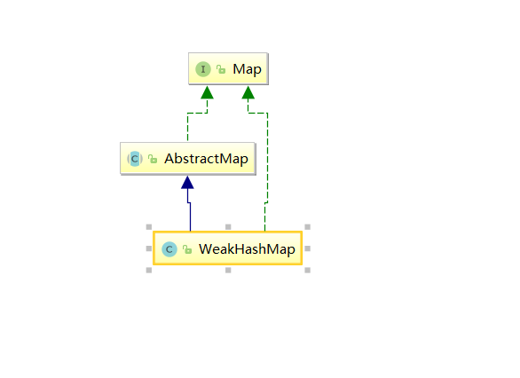

# <center>WeakHashMap </center>

## 简介

WeakHashMap也是Map接口的一个实现类，它与HashMap相似，也是一个哈希表，存储key-value pair，而且也是非线程安全的。不过WeakHashMap并没有引入红黑树来尽量规避哈希冲突带来的影响，内部实现只是 数组+单链表。此外，WeakHashMap与HashMap 最大的不同之处在于，WeakHashMap的key是 “弱键”（weak keys），即 当一个key不再正常使用时，key对应的key-value pair将自动从WeakHashMap中删除，在这种情况下，即使key对应的key-value pair的存在，这个key依然会被GC回收，如此以来，它对应的key-value pair也就被从map中有效地删除了。

## Java的四种引用

在正式进入WeakHashMap源码之前，我们需要先对 “弱引用”有一个基本的认识，为此这里先介绍一下JDK 1.2开始推出的四种引用：

- 强引用（Strong Reference） 强引用是指在程序代码之中普遍存在的，类似 `Objective obj = new Object()`这类的引用，只要强引用还存在，垃圾收集器永远不会回收掉被引用的对象。
- 软引用（Soft Reference） 软引用是用来描述一些还有用但并非必需的对象，对于软引用关联着的对象， 在系统将要发生内存溢出异常之前，将会把这些对象列进回收范围之中进行第二次回收。如果这次回收还没有足够的内存，才会抛出内存溢出异常。在JDK 1.2之后，提供了 SoftReference类来实现软引用。
- 弱引用（Weak Reference） 弱引用也是用来描述非必需对象的，但是它的强度比软引用更弱一点， 被弱引用关联的对象只能生存到下一次垃圾收集发生之前。当垃圾收集器工作时，无论当前内存是否足够，都会回收掉只被弱引用关联的对象。在JDK 1.2之后，提供了 WeakReference类来实现弱引用。
- 虚引用（PhantomReference） 虚引用也称为幽灵引用或者幻影引用，它是最弱的一种引用关系。一个对象是否有虚引用的存在，完全不会对其生存时间构成影响，也无法通过虚引用来取得一个对象实例。为一个对象设置虚引用关联的 唯一目的就是 能在这个对象被收集器回收时收到一个系统通知。在JDK 1.2之后，提供了 PhantomReference类来实现虚引用。

我们说WeakHashMap的key是weak-keys，即是说这个Map实现类的key值都是弱引用

## 继承关系



## 源码分析

### 属性

```java
//默认桶容量
private static final int DEFAULT_INITIAL_CAPACITY = 16;

//桶容量最大2的30次方
private static final int MAXIMUM_CAPACITY = 1 << 30;

//默认装载因子
private static final float DEFAULT_LOAD_FACTOR = 0.75f;
//桶
Entry<K,V>[] table;

//元素个数
private int size;

//扩容门槛
private int threshold;
//装载因子
private final float loadFactor;

//弱引用队列，当弱键失效时会把Entry添加到这个队列中
private final ReferenceQueue<Object> queue = new ReferenceQueue<>();

//修改次数
int modCount;
```
### 内部类

#### Entry

```java
//Entry中没有key key作为弱引用存放在 Reference类中
private static class Entry<K,V> extends WeakReference<Object> implements Map.Entry<K,V> {
    V value;
    final int hash;
    Entry<K,V> next;

    /**
     * Creates new entry.
     */
    Entry(Object key, V value,
          ReferenceQueue<Object> queue,
          int hash, Entry<K,V> next) {
        super(key, queue);
        this.value = value;
        this.hash  = hash;
        this.next  = next;
    }

    @SuppressWarnings("unchecked")
    public K getKey() {
        return (K) WeakHashMap.unmaskNull(get());
    }

    public V getValue() {
        return value;
    }

    public V setValue(V newValue) {
        V oldValue = value;
        value = newValue;
        return oldValue;
    }

    public boolean equals(Object o) {
        if (!(o instanceof Map.Entry))
            return false;
        Map.Entry<?,?> e = (Map.Entry<?,?>)o;
        K k1 = getKey();
        Object k2 = e.getKey();
        if (k1 == k2 || (k1 != null && k1.equals(k2))) {
            V v1 = getValue();
            Object v2 = e.getValue();
            if (v1 == v2 || (v1 != null && v1.equals(v2)))
                return true;
        }
        return false;
    }

    public int hashCode() {
        K k = getKey();
        V v = getValue();
        return Objects.hashCode(k) ^ Objects.hashCode(v);
    }

    public String toString() {
        return getKey() + "=" + getValue();
    }
}
public class WeakReference<T> extends Reference<T> {

    /**
     * Creates a new weak reference that refers to the given object.  The new
     * reference is not registered with any queue.
     *
     * @param referent object the new weak reference will refer to
     */
    public WeakReference(T referent) {
        super(referent);
    }}

public abstract class Reference<T> {
    //存放key
     private T referent;         /* Treated specially by GC */
//引用队列
    volatile ReferenceQueue<? super T> queue;

      Reference(T referent, ReferenceQueue<? super T> queue) {
        this.referent = referent;
        this.queue = (queue == null) ? ReferenceQueue.NULL : queue;
    }}
```

### 构造方法

```java
public WeakHashMap(int initialCapacity, float loadFactor) {
    if (initialCapacity < 0)//初始化容量不能小于0
        throw new IllegalArgumentException("Illegal Initial Capacity: "+
                                           initialCapacity);
    if (initialCapacity > MAXIMUM_CAPACITY)
        //如果传入的容量大于最大容量，则取最大容量
        initialCapacity = MAXIMUM_CAPACITY;

    if (loadFactor <= 0 || Float.isNaN(loadFactor))//负载因子不符合要求
        throw new IllegalArgumentException("Illegal Load factor: "+
                                           loadFactor);
    int capacity = 1;
    while (capacity < initialCapacity)
        capacity <<= 1;//大于initialCapacity的最小2的n次方
    table = newTable(capacity);
    this.loadFactor = loadFactor;
    threshold = (int)(capacity * loadFactor);
}


public WeakHashMap(int initialCapacity) {
    this(initialCapacity, DEFAULT_LOAD_FACTOR);
}


public WeakHashMap() {
    this(DEFAULT_INITIAL_CAPACITY, DEFAULT_LOAD_FACTOR);
}


public WeakHashMap(Map<? extends K, ? extends V> m) {
    this(Math.max((int) (m.size() / DEFAULT_LOAD_FACTOR) + 1,
            DEFAULT_INITIAL_CAPACITY),
         DEFAULT_LOAD_FACTOR);
    putAll(m);
}
```

### 其他方法

#### put(K key, V value)

```java
public V put(K key, V value) {
    //如果可以为null ，则用NULL_KEY代替
    Object k = maskNull(key);
    int h = hash(k);//计算key的hash值
    Entry<K,V>[] tab = getTable();
    int i = indexFor(h, tab.length);
//遍历桶中链表
    for (Entry<K,V> e = tab[i]; e != null; e = e.next) {
        if (h == e.hash && eq(k, e.get())) {
            V oldValue = e.value;
            //如果找到了元素就使用新值替换旧值
            if (value != oldValue)
                e.value = value;
            return oldValue;//返回旧值
        }
    }

    modCount++;
    //没有找到就把新值插入到表头
    Entry<K,V> e = tab[i];
    tab[i] = new Entry<>(k, value, queue, h, e);
    if (++size >= threshold)
        // 如果插入元素后数量达到了扩容门槛就把桶的数量扩容为2倍大小
        resize(tab.length * 2);
    return null;
}
//获取桶
 private Entry<K,V>[] getTable() {
        expungeStaleEntries();
        return table;
    }


```
#### expungeStaleEntries() 

剔除失效的Entry

```java
private void expungeStaleEntries() {
        for (Object x; (x = queue.poll()) != null; ) {
            synchronized (queue) {
                @SuppressWarnings("unchecked")
                    Entry<K,V> e = (Entry<K,V>) x;
                //计算元素在哪个桶中
                int i = indexFor(e.hash, table.length);
				//找到所在的桶
                Entry<K,V> prev = table[i];
                Entry<K,V> p = prev;
                //遍历链表
                while (p != null) {
                    Entry<K,V> next = p.next;
                    if (p == e) {
                        //删除元素
                        if (prev == e)
                            table[i] = next;
                        else
                            prev.next = next;
                        // Must not null out e.next;
                        // stale entries may be in use by a HashIterator
                        e.value = null; // Help GC
                        size--;
                        break;
                    }
                    prev = p;
                    p = next;
                }
            }
        }
    }

```
#### resize(int newCapacity)

扩容

```java
void resize(int newCapacity) {
    //获取酒桶 
    Entry<K,V>[] oldTable = getTable();
    int oldCapacity = oldTable.length;//旧容量
    if (oldCapacity == MAXIMUM_CAPACITY) {
        threshold = Integer.MAX_VALUE;
        return;
    }
//新桶
    Entry<K,V>[] newTable = newTable(newCapacity);
    transfer(oldTable, newTable);//酒桶的数据转移到新桶中
    table = newTable;//把新桶赋值给table

    //如果元素个数大于扩容门槛的一半，则使用新桶和新容量，并计算新的扩容门槛
    if (size >= threshold / 2) {
        threshold = (int)(newCapacity * loadFactor);
    } else {
        //否则把元素再转移回旧桶，还是使用旧桶， 因为在transfer的时候会清除失效的Entry，所以元素个数可能没有那么大了，就不需要扩容了
        expungeStaleEntries();
        transfer(newTable, oldTable);
        table = oldTable;
    }
}

private void transfer(Entry<K,V>[] src, Entry<K,V>[] dest) {
    //遍历旧桶
        for (int j = 0; j < src.length; ++j) {
            Entry<K,V> e = src[j];
            src[j] = null;
            while (e != null) {
                Entry<K,V> next = e.next;
                Object key = e.get();
                if (key == null) {
                    //如果key等于了null就清除，说明key被gc清理掉了，则把整个Entry清除
                    e.next = null;  // Help GC
                    e.value = null; //  "   "
                    size--;
                } else {
                    //否则就计算在新桶中的位置并把这个元素放在新桶对应链表的头部
                    int i = indexFor(e.hash, dest.length);
                    e.next = dest[i];
                    dest[i] = e;
                }
                e = next;
            }
        }
    }
```
#### get(Object key)

```java
public V get(Object key) {
    Object k = maskNull(key);
    int h = hash(k);
    Entry<K,V>[] tab = getTable();
    int index = indexFor(h, tab.length);
    Entry<K,V> e = tab[index];
    while (e != null) {//遍历桶 找到目标元素
        if (e.hash == h && eq(k, e.get()))
            return e.value;
        e = e.next;
    }
    return null;
}
```

