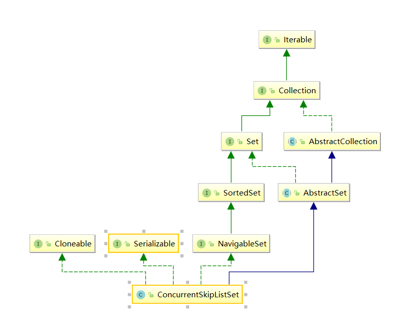

# ConcurrentSkipListSet

## 简介

ConcurrentSkipListSet是一种Set类型，具有互异性、无序性的特点。其继承关系如下



其实现了NavigableSet接口，提供了根据指定Key返回最接近项、按升序、降序返回所有建的视图等功能。唯一的区别是NavigableSet针对的仅仅是键值NavigableMap针对键值对进行操作。

## 源码解析

### 属性

```java
private final ConcurrentNavigableMap<E,Object> m;//存储使用的map
```

 ### 方法

ConcurrentSkipListSet的实现非常简单，其内部引用了一个ConcurrentSkipListMap对象，所有API方法均委托ConcurrentSkipListMap对象完成

```java
public ConcurrentSkipListSet() {
    m = new ConcurrentSkipListMap<E,Object>();
}

public ConcurrentSkipListSet(Comparator<? super E> comparator) {
    m = new ConcurrentSkipListMap<E,Object>(comparator);
}

public ConcurrentSkipListSet(Collection<? extends E> c) {
    m = new ConcurrentSkipListMap<E,Object>();
    addAll(c);
}

public ConcurrentSkipListSet(SortedSet<E> s) {
    m = new ConcurrentSkipListMap<E,Object>(s.comparator());
    addAll(s);
}

ConcurrentSkipListSet(ConcurrentNavigableMap<E,Object> m) {
    this.m = m;
}

public ConcurrentSkipListSet<E> clone() {
    try {
        @SuppressWarnings("unchecked")
        ConcurrentSkipListSet<E> clone =
            (ConcurrentSkipListSet<E>) super.clone();
        clone.setMap(new ConcurrentSkipListMap<E,Object>(m));
        return clone;
    } catch (CloneNotSupportedException e) {
        throw new InternalError();
    }
}
//返回元素个数
public int size() {
        return m.size();
    }
//返回map中的元素是否为空
public boolean isEmpty() {
        return m.isEmpty();
    }

 //检查元素是否包含某个元素
    public boolean contains(Object o) {
        return m.containsKey(o);
    }

    //添加一个元素
    public boolean add(E e) {
        return m.putIfAbsent(e, Boolean.TRUE) == null;
    }

//移除元素o
    public boolean remove(Object o) {
        return m.remove(o, Boolean.TRUE);
    }

    //清空元素
        public void clear() {
        m.clear();
    }

    //清空所有元素
    public Iterator<E> iterator() {
        return m.navigableKeySet().iterator();
    }

    //返回迭代器
    public Iterator<E> descendingIterator() {
        return m.descendingKeySet().iterator();
    }


    /* ---------------- AbstractSet Overrides -------------- */

//比较相等方法
    public boolean equals(Object o) {
        // Override AbstractSet version to avoid calling size()
        if (o == this)
            return true;
        if (!(o instanceof Set))
            return false;
        Collection<?> c = (Collection<?>) o;
        try {
            return containsAll(c) && c.containsAll(this);
        } catch (ClassCastException unused) {
            return false;
        } catch (NullPointerException unused) {
            return false;
        }
    }

    //移除C中所有元素
    public boolean removeAll(Collection<?> c) {
        // Override AbstractSet version to avoid unnecessary call to size()
        boolean modified = false;
        for (Object e : c)
            if (remove(e))
                modified = true;
        return modified;
    }

    /* ---------------- Relational operations -------------- */

     
// 小于e的最大元素
    public E lower(E e) {
        return m.lowerKey(e);
    }

// 小于等于e的最大元素/
    public E floor(E e) {
        return m.floorKey(e);
    }

  //大于e的元素
    public E ceiling(E e) {
        return m.ceilingKey(e);
    }

    /**
     * @throws ClassCastException {@inheritDoc}
     * @throws NullPointerException if the specified element is null
     */
    public E higher(E e) {
        return m.higherKey(e);
    }

    public E pollFirst() {
        Map.Entry<E,Object> e = m.pollFirstEntry();
        return (e == null) ? null : e.getKey();
    }

    public E pollLast() {
        Map.Entry<E,Object> e = m.pollLastEntry();
        return (e == null) ? null : e.getKey();
    }


    /* ---------------- SortedSet operations -------------- */


    public Comparator<? super E> comparator() {
        return m.comparator();
    }

    /**
     * @throws java.util.NoSuchElementException {@inheritDoc}
     */
    public E first() {
        return m.firstKey();
    }

    /**
     * @throws java.util.NoSuchElementException {@inheritDoc}
     */
    public E last() {
        return m.lastKey();
    }

    /**
     * @throws ClassCastException {@inheritDoc}
     * @throws NullPointerException if {@code fromElement} or
     *         {@code toElement} is null
     * @throws IllegalArgumentException {@inheritDoc}
     */
    public NavigableSet<E> subSet(E fromElement,
                                  boolean fromInclusive,
                                  E toElement,
                                  boolean toInclusive) {
        return new ConcurrentSkipListSet<E>
            (m.subMap(fromElement, fromInclusive,
                      toElement,   toInclusive));
    }

    /**
     * @throws ClassCastException {@inheritDoc}
     * @throws NullPointerException if {@code toElement} is null
     * @throws IllegalArgumentException {@inheritDoc}
     */
    public NavigableSet<E> headSet(E toElement, boolean inclusive) {
        return new ConcurrentSkipListSet<E>(m.headMap(toElement, inclusive));
    }

    /**
     * @throws ClassCastException {@inheritDoc}
     * @throws NullPointerException if {@code fromElement} is null
     * @throws IllegalArgumentException {@inheritDoc}
     */
    public NavigableSet<E> tailSet(E fromElement, boolean inclusive) {
        return new ConcurrentSkipListSet<E>(m.tailMap(fromElement, inclusive));
    }

    /**
     * @throws ClassCastException {@inheritDoc}
     * @throws NullPointerException if {@code fromElement} or
     *         {@code toElement} is null
     * @throws IllegalArgumentException {@inheritDoc}
     */
    public NavigableSet<E> subSet(E fromElement, E toElement) {
        return subSet(fromElement, true, toElement, false);
    }

    /**
     * @throws ClassCastException {@inheritDoc}
     * @throws NullPointerException if {@code toElement} is null
     * @throws IllegalArgumentException {@inheritDoc}
     */
    public NavigableSet<E> headSet(E toElement) {
        return headSet(toElement, false);
    }

    /**
     * @throws ClassCastException {@inheritDoc}
     * @throws NullPointerException if {@code fromElement} is null
     * @throws IllegalArgumentException {@inheritDoc}
     */
    public NavigableSet<E> tailSet(E fromElement) {
        return tailSet(fromElement, true);
    }

    /**
     * Returns a reverse order view of the elements contained in this set.
     * The descending set is backed by this set, so changes to the set are
     * reflected in the descending set, and vice-versa.
     *
     * <p>The returned set has an ordering equivalent to
     * {@link Collections#reverseOrder(Comparator) Collections.reverseOrder}{@code (comparator())}.
     * The expression {@code s.descendingSet().descendingSet()} returns a
     * view of {@code s} essentially equivalent to {@code s}.
     *
     * @return a reverse order view of this set
     */
    public NavigableSet<E> descendingSet() {
        return new ConcurrentSkipListSet<E>(m.descendingMap());
    }

    /**
     * Returns a {@link Spliterator} over the elements in this set.
     *
     * <p>The {@code Spliterator} reports {@link Spliterator#CONCURRENT},
     * {@link Spliterator#NONNULL}, {@link Spliterator#DISTINCT},
     * {@link Spliterator#SORTED} and {@link Spliterator#ORDERED}, with an
     * encounter order that is ascending order.  Overriding implementations
     * should document the reporting of additional characteristic values.
     *
     * <p>The spliterator's comparator (see
     * {@link java.util.Spliterator#getComparator()}) is {@code null} if
     * the set's comparator (see {@link #comparator()}) is {@code null}.
     * Otherwise, the spliterator's comparator is the same as or imposes the
     * same total ordering as the set's comparator.
     *
     * @return a {@code Spliterator} over the elements in this set
     * @since 1.8
     */
    @SuppressWarnings("unchecked")
    public Spliterator<E> spliterator() {
        if (m instanceof ConcurrentSkipListMap)
            return ((ConcurrentSkipListMap<E,?>)m).keySpliterator();
        else
            return (Spliterator<E>)((ConcurrentSkipListMap.SubMap<E,?>)m).keyIterator();
    }

    // Support for resetting map in clone
    private void setMap(ConcurrentNavigableMap<E,Object> map) {
        UNSAFE.putObjectVolatile(this, mapOffset, map);
    }

    private static final sun.misc.Unsafe UNSAFE;
    private static final long mapOffset;
    static {
        try {
            UNSAFE = sun.misc.Unsafe.getUnsafe();
            Class<?> k = ConcurrentSkipListSet.class;
            mapOffset = UNSAFE.objectFieldOffset
                (k.getDeclaredField("m"));
        } catch (Exception e) {
            throw new Error(e);
        }
    }
```