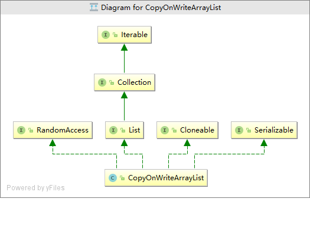

# CopyOnWriteArrayList

## 简介

CopyOnWriteArrayList是JAVA中的并发容器类，同时也是符合写时复制思想的CopyOnWrite容器。写时复制思想即是当我们往一个容器添加元素的时候，不直接往当前容器添加，而是先将当前容器进行Copy，复制出一个新的容器，然后新的容器里添加元素，添加完元素之后，再将原容器的引用指向新的容器。这样做的好处是我们可以对CopyOnWrite容器进行并发的读，而不需要加锁，因为当前容器不会添加任何元素。所以CopyOnWrite容器也是一种读写分离的思想，读和写不同的容器。

## 继承体系



## 源码分析

### 属性

```java
//修改时加的锁
final transient ReentrantLock lock = new ReentrantLock();

//存储数据的容器
private transient volatile Object[] array;
```

### 构造方法

```java
public CopyOnWriteArrayList() {//默认构造,初始化容量为0
    setArray(new Object[0]);
}

//
public CopyOnWriteArrayList(Collection<? extends E> c) {
    Object[] elements;
    if (c.getClass() == CopyOnWriteArrayList.class)
        //传入的集合是CopyOnWriteArrayList 则直接获取array赋给elements
        elements = ((CopyOnWriteArrayList<?>)c).getArray();
    else {
        //将集合转为数组
        elements = c.toArray();
        // c.toArray might (incorrectly) not return Object[] (see 6260652)
        if (elements.getClass() != Object[].class)
            //将数组复制到新的数组中
            elements = Arrays.copyOf(elements, elements.length, Object[].class);
    }
    setArray(elements);//将数组设置到array中
}


public CopyOnWriteArrayList(E[] toCopyIn) {
    setArray(Arrays.copyOf(toCopyIn, toCopyIn.length, Object[].class));
}
```

### 其他常见方法

####boolean add(E e)

```java
public boolean add(E e) {
    final ReentrantLock lock = this.lock;
    lock.lock();//加锁
    try {
        Object[] elements = getArray();//获取旧数组
        int len = elements.length;//旧数组的长度
        //将旧数组的元素复制到新数组中，新数组长度＋1
        Object[] newElements = Arrays.copyOf(elements, len + 1);
        newElements[len] = e;//将数组添加到新数组的最后一位
        setArray(newElements);
        return true;
    } finally {
        lock.unlock();
    }
}
```
#### add(int index, E element)

```java
public void add(int index, E element) {
    final ReentrantLock lock = this.lock;
    lock.lock();
    try {
        //获取旧数组
        Object[] elements = getArray();
        int len = elements.length;
        if (index > len || index < 0)//检查输入的数组角标是否合法
            throw new IndexOutOfBoundsException("Index: "+index+
                                                ", Size: "+len);
        Object[] newElements;
        int numMoved = len - index;
        if (numMoved == 0)
            //插入的位置是最后一位
            newElements = Arrays.copyOf(elements, len + 1);
        else {
            newElements = new Object[len + 1];
            //拷贝旧数组前index的元素到新数组中
            System.arraycopy(elements, 0, newElements, 0, index);
            //将index及其之后的元素往后挪一位拷贝到新数组中
            System.arraycopy(elements, index, newElements, index + 1,
                             numMoved);
        }
        newElements[index] = element;// 将元素放置在index处
        setArray(newElements);
    } finally {
        lock.unlock();
    }
}
```
#### addIfAbsent(E e)

```java
public boolean addIfAbsent(E e) {
    Object[] snapshot = getArray();//获取数组，快照
    //如果该元素不在数组中返回false，否则调用addIfAbsent
    return indexOf(e, snapshot, 0, snapshot.length) >= 0 ? false :
        addIfAbsent(e, snapshot);
}


private boolean addIfAbsent(E e, Object[] snapshot) {
    final ReentrantLock lock = this.lock;
    lock.lock();
    try {
        Object[] current = getArray();
        int len = current.length;
        if (snapshot != current) {
            //如果快照与当前获取的数组不是同一个对象，获取两者中长度较小的一位
            int common = Math.min(snapshot.length, len);
            for (int i = 0; i < common; i++)
                //重新检查元素是否在刚获取的数组里
                if (current[i] != snapshot[i] && eq(e, current[i]))
                    return false;
            if (indexOf(e, current, common, len) >= 0)
                    return false;
        }
        Object[] newElements = Arrays.copyOf(current, len + 1);// 拷贝一份n+1的数组
        newElements[len] = e;// 将元素放在最后一位
        setArray(newElements);
        return true;
    } finally {
        lock.unlock();
    }
}
```

#### get(int index)

读取数据不用加锁

```java
public E get(int index) {
    return get(getArray(), index);
} 
private E get(Object[] a, int index) {
        return (E) a[index];
    }
```
#### remove(int index)

```java
public E remove(int index) {
    final ReentrantLock lock = this.lock;
    lock.lock();
    try {
        Object[] elements = getArray();
        int len = elements.length;
        //获取要删除位置的元素
        E oldValue = get(elements, index);
        int numMoved = len - index - 1;
        if (numMoved == 0)
            //移除最后一位 直接复制从0到len-1的数组
            setArray(Arrays.copyOf(elements, len - 1));
        else {
            //新建数组长度-1
            Object[] newElements = new Object[len - 1];
            //将原数组从0开始复制index个元素到新数组中
            System.arraycopy(elements, 0, newElements, 0, index);
            //将index后面(不包含)的元素往前挪一位
            System.arraycopy(elements, index + 1, newElements, index,
                             numMoved);
            setArray(newElements);
        }
        return oldValue;
    } finally {
        lock.unlock();
    }
}
```
## CopyOnWrite的缺点　

CopyOnWrite容器有很多优点，但是同时也存在两个问题，即内存占用问题和数据一致性问题。所以在开发的时候需要注意一下。

　　**内存占用问题**。因为CopyOnWrite的写时复制机制，所以在进行写操作的时候，内存里会同时驻扎两个对象的内存，旧的对象和新写入的对象（注意:在复制的时候只是复制容器里的引用，只是在写的时候会创建新对象添加到新容器里，而旧容器的对象还在使用，所以有两份对象内存）。如果这些对象占用的内存比较大，比如说200M左右，那么再写入100M数据进去，内存就会占用300M，那么这个时候很有可能造成频繁的Yong GC和Full GC。之前我们系统中使用了一个服务由于每晚使用CopyOnWrite机制更新大对象，造成了每晚15秒的Full GC，应用响应时间也随之变长。

　　针对内存占用问题，可以通过压缩容器中的元素的方法来减少大对象的内存消耗，比如，如果元素全是10进制的数字，可以考虑把它压缩成36进制或64进制。或者不使用CopyOnWrite容器，而使用其他的并发容器，如ConcurrentHashMap。

　　**数据一致性问题**。CopyOnWrite容器只能保证数据的最终一致性，不能保证数据的实时一致性。所以如果你希望写入的的数据，马上能读到，请不要使用CopyOnWrite容器。