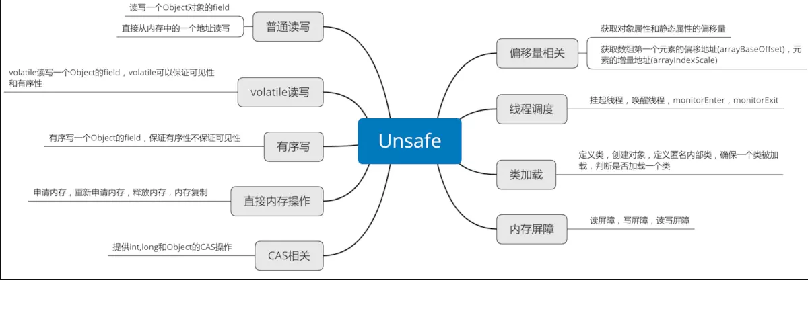

# <center>unsafe源码</center>


## 简介

Java和C++语言的一个重要区别就是Java中我们无法直接操作一块内存区域，不能像C++中那样可以自己申请内存和释放内存。Java中的Unsafe类为我们提供了类似C++手动管理内存的能力。
 Unsafe类，全限定名是sun.misc.Unsafe，从名字中我们可以看出来这个类对普通程序员来说是“危险”的，。但是它的很多方法都是很偏向底层的，一般人使用可能会对系统造成不好的影响，所以java官方不推荐使用这个类。但是不影响我们分析这个类，并且它也是分析并发的基础。


## 源码解析

  ### 类的属性及初始化

```java
    private static final Unsafe theUnsafe;//实例
    public static final int INVALID_FIELD_OFFSET = -1;
    public static final int ARRAY_BOOLEAN_BASE_OFFSET;
    public static final int ARRAY_BYTE_BASE_OFFSET;
    public static final int ARRAY_SHORT_BASE_OFFSET;
    public static final int ARRAY_CHAR_BASE_OFFSET;
    public static final int ARRAY_INT_BASE_OFFSET;
    public static final int ARRAY_LONG_BASE_OFFSET;
    public static final int ARRAY_FLOAT_BASE_OFFSET;
    public static final int ARRAY_DOUBLE_BASE_OFFSET;
    public static final int ARRAY_OBJECT_BASE_OFFSET;
    public static final int ARRAY_BOOLEAN_INDEX_SCALE;
    public static final int ARRAY_BYTE_INDEX_SCALE;
    public static final int ARRAY_SHORT_INDEX_SCALE;
    public static final int ARRAY_CHAR_INDEX_SCALE;
    public static final int ARRAY_INT_INDEX_SCALE;
    public static final int ARRAY_LONG_INDEX_SCALE;
    public static final int ARRAY_FLOAT_INDEX_SCALE;
    public static final int ARRAY_DOUBLE_INDEX_SCALE;
    public static final int ARRAY_OBJECT_INDEX_SCALE;
    public static final int ADDRESS_SIZE;

    private static native void registerNatives();

    private Unsafe() {
    }

    @CallerSensitive//调用Reflection.getCallerClass()需要由bootstrap class loader、extension class loader加载的类可以调用

    public static Unsafe getUnsafe() {
        Class var0 = Reflection.getCallerClass();
        if (!VM.isSystemDomainLoader(var0.getClassLoader())) {
            throw new SecurityException("Unsafe");
        } else {
            return theUnsafe;
        }
    }
 static {
     /*Java有两种方法：Java方法和本地方法。Java方法是由Java语言编写，编译成字节码，存储在class文件中。本地方法是由其他语言（比如C，C++，或者汇编）编写的，编译成和处理器相关的机器代码。本地方法保存在动态连接库中，格式是各个平台专有的。Java方法是平台无关的，单本地方法却不是。运行中的Java程序调用本地方法时，虚拟机装载包含这个本地方法的动态库，并调用这个方法。本地方法是联系Java程序和底层主机操作系统的连接方法。
     一个Java程序要想调用一个本地方法，需要执行两个步骤：第一，通过System.loadLibrary()将包含本地方法实现的动态文件加载进内存；第二，当Java程序需要调用本地方法时，虚拟机在加载的动态文件中定位并链接该本地方法，从而得以执行本地方法。registerNatives()方法的作用就是取代第二步，让程序主动将本地方法链接到调用方，当Java程序需要调用本地方法时就可以直接调用，而不需要虚拟机再去定位并链接。
   类被加载的时候，注册的方法就是该类所包含的除了registerNatives()方法以外的所有本地方法。
     */
        registerNatives();
        Reflection.registerMethodsToFilter(Unsafe.class, new String[]{"getUnsafe"});
        theUnsafe = new Unsafe();
        ARRAY_BOOLEAN_BASE_OFFSET = theUnsafe.arrayBaseOffset(boolean[].class);
        ARRAY_BYTE_BASE_OFFSET = theUnsafe.arrayBaseOffset(byte[].class);
        ARRAY_SHORT_BASE_OFFSET = theUnsafe.arrayBaseOffset(short[].class);
        ARRAY_CHAR_BASE_OFFSET = theUnsafe.arrayBaseOffset(char[].class);
        ARRAY_INT_BASE_OFFSET = theUnsafe.arrayBaseOffset(int[].class);
        ARRAY_LONG_BASE_OFFSET = theUnsafe.arrayBaseOffset(long[].class);
        ARRAY_FLOAT_BASE_OFFSET = theUnsafe.arrayBaseOffset(float[].class);
        ARRAY_DOUBLE_BASE_OFFSET = theUnsafe.arrayBaseOffset(double[].class);
        ARRAY_OBJECT_BASE_OFFSET = theUnsafe.arrayBaseOffset(Object[].class);
        ARRAY_BOOLEAN_INDEX_SCALE = theUnsafe.arrayIndexScale(boolean[].class);
        ARRAY_BYTE_INDEX_SCALE = theUnsafe.arrayIndexScale(byte[].class);
        ARRAY_SHORT_INDEX_SCALE = theUnsafe.arrayIndexScale(short[].class);
        ARRAY_CHAR_INDEX_SCALE = theUnsafe.arrayIndexScale(char[].class);
        ARRAY_INT_INDEX_SCALE = theUnsafe.arrayIndexScale(int[].class);
        ARRAY_LONG_INDEX_SCALE = theUnsafe.arrayIndexScale(long[].class);
        ARRAY_FLOAT_INDEX_SCALE = theUnsafe.arrayIndexScale(float[].class);
        ARRAY_DOUBLE_INDEX_SCALE = theUnsafe.arrayIndexScale(double[].class);
        ARRAY_OBJECT_INDEX_SCALE = theUnsafe.arrayIndexScale(Object[].class);
        ADDRESS_SIZE = theUnsafe.addressSize();
    }
```


unsafe主要功能：



### 对象相关方法

* ```java
  // 通过给定的Java变量获取引用值。这里实际上是获取一个Java对象o中，获取偏移地址为offset的属性的值，此方法可以突破修饰符的抑制，也就是无视private、protected和default修饰符。类似的方法有getInt、getDouble等等
  public native Object getObject(Object var1, long var2);
  ```

* ```java
  // 将引用值存储到给定的Java变量中。这里实际上是设置一个Java对象o中偏移地址为offset的属性的值为x，此方法可以突破修饰符的抑制，也就是无视private、protected和default修饰符。类似的方法有putInt、putDouble等等。
  public native void putObject(Object var1, long var2, Object var4);
  ```

* ```java
  // 此方法和上面的getObject功能类似，不过附加了'volatile'加载语义，也就是强制从主存中获取属性值。类似的方法有getIntVolatile、getDoubleVolatile等等。这个方法要求被使用的属性被volatile修饰，否则功能和getObject方法相同。
  public native Object getObjectVolatile(Object var1, long var2);
  ```

* ```java
  // 此方法和上面的putObject功能类似，不过附加了'volatile'加载语义，也就是设置值的时候强制(JMM会保证获得锁到释放锁之间所有对象的状态更新都会在锁被释放之后)更新到主存，从而保证这些变更对其他线程是可见的。类似的方法有putIntVolatile、putDoubleVolatile等等。这个方法要求被使用的属性被volatile修饰，否则功能和putObject方法相同。
  public native void putObjectVolatile(Object var1, long var2, Object var4);
  ```

* ```java
  // 返回给定的静态属性在它的类的存储分配中的位置(偏移地址)。不要在这个偏移量上执行任何类型的算术运算，它只是一个被传递给不安全的堆内存访问器的cookie。注意：这个方法仅仅针对静态属性，使用在非静态属性上会抛异常。
  public native long staticFieldOffset(Field var1);
  // 返回给定的非静态属性在它的类的存储分配中的位置(偏移地址)。不要在这个偏移量上执行任何类型的算术运算，它只是一个被传递给不安全的堆内存访问器的cookie。注意：这个方法仅仅针对非静态属性，使用在静态属性上会抛异常。
  public native long objectFieldOffset(Field var1);
  // 返回给定的静态属性的位置，配合staticFieldOffset方法使用。实际上，这个方法返回值就是静态属性所在的Class对象的一个内存快照。注释中说到，此方法返回的Object有可能为null，它只是一个'cookie'而不是真实的对象，不要直接使用的它的实例中的获取属性和设置属性的方法，它的作用只是方便调用上面提到的像getInt(Object,long)等等的任意方法。
  public native Object staticFieldBase(Field var1);
  ```

* ```java
  // 检测给定的类是否需要初始化。通常需要使用在获取一个类的静态属性的时候(因为一个类如果没初始化，它的静态属性也不会初始化)。 此方法当且仅当ensureClassInitialized方法不生效的时候才返回false。
  public native boolean shouldBeInitialized(Class<?> var1);
  // 检测给定的类是否已经初始化。通常需要使用在获取一个类的静态属性的时候(因为一个类如果没初始化，它的静态属性也不会初始化)。
  public native void ensureClassInitialized(Class<?> var1);
  ```

* ```java
  // 返回数组中第一个元素的偏移地址
  public native int arrayBaseOffset(Class<?> var1);
  // 数组中每个元素的增量地址，可以通过 arrayBaseOffset和arrayIndexScale确定所有的数组元素
  public native int arrayIndexScale(Class<?> var1);
  ```

* ```java
  // 告诉JVM定义一个类，返回类实例，此方法会跳过JVM的所有安全检查。默认情况下，ClassLoader(类加载器)和ProtectionDomain(保护域)实例应该来源于调用者
  public native Class<?> defineClass(String var1, byte[] var2, int var3, int var4, ClassLoader var5, ProtectionDomain var6);
  //用于动态的创建一个匿名内部类
    public native Class<?> defineAnonymousClass(Class<?> var1, byte[] var2, Object[] var3);
  //方法用于创建一个类的实例，但是不会调用这个实例的构造方法，如果这个类还未被初始化，则初始化这个类
     public native Object allocateInstance(Class<?> var1) throws InstantiationException;
  
  ```
### 直接内存操作

* ```java
  //分配一块新的本地内存，通过bytes指定内存块的大小(单位是byte)，返回新开辟的内存的地址。如果内存块的内容不被初始化，那么它们一般会变成内存垃圾。生成的本机指针永远不会为零，并将对所有值类型进行对齐。可以通过freeMemory方法释放内存块，或者通过reallocateMemory方法调整内存块大小。bytes值为负数或者过大会抛出IllegalArgumentException异常，如果系统拒绝分配内存会抛出OutOfMemoryError异常
  public native long allocateMemory(long var1);
  //通过指定的内存地址address重新调整本地内存块的大小，调整后的内存块大小通过bytes指定(单位为byte)。可以通过freeMemory方法释放内存块，或者通过reallocateMemory方法调整内存块大小。bytes值为负数或者过大会抛出IllegalArgumentException异常，如果系统拒绝分配内存会抛出OutOfMemoryError异常
  public native long reallocateMemory(long var1, long var3);
  //将给定内存块中的所有字节设置为固定值(通常是0)。内存块的地址由对象引用o和偏移地址共同决定，如果对象引用o为null，offset就是绝对地址。第三个参数就是内存块的大小，如果使用allocateMemory进行内存开辟的话，这里的值应该和allocateMemory的参数一致。value就是设置的固定值，一般为0(这里可以参考netty的DirectByteBuffer)
  public native void setMemory(Object var1, long var2, long var4, byte var6);
  // 内存复制
  public native void copyMemory(Object var1, long var2, Object var4, long var5, long var7);
  // 清除内存
  public native void freeMemory(long var1);
  ```

### CAS相关

+ ```java
  /* 针对Object对象进行CAS操作。即是对应Java变量引用o，原子性地更新o中偏移地址为offset的属性的值为x，当且仅的偏移地址为offset的属性的当前值为expected才会更新成功返回true，否则返回false。
  o：目标Java变量引用。
  offset：目标Java变量中的目标属性的偏移地址。
  expected：目标Java变量中的目标属性的期望的当前值。
  x：目标Java变量中的目标属性的目标更新值。
  类似的方法有compareAndSwapInt和compareAndSwapLong，在Jdk8中基于CAS扩展出来的方法有getAndAddInt、getAndAddLong、getAndSetInt、getAndSetLong、getAndSetObject，它们的作用都是：通过CAS设置新的值，返回旧的值*/
  public final native boolean compareAndSwapObject(Object o, long offset, Object expected, Object x);
  ```

### 线程调度

+ ```java
  // 释放被park创建的在一个线程上的阻塞。这个方法也可以被使用来终止一个先前调用park导致的阻塞。这个操作是不安全的，因此必须保证线程是存活的(thread has not been destroyed)。从Java代码中判断一个线程是否存活的是显而易见的，但是从native代码中这机会是不可能自动完成的。
  public native void unpark(Object var1);
  // 阻塞当前线程直到一个unpark方法出现(被调用)、一个用于unpark方法已经出现过(在此park方法调用之前已经调用过)、线程被中断或者time时间到期(也就是阻塞超时)。在time非零的情况下，如果isAbsolute为true，time是相对于新纪元之后的毫秒，否则time表示纳秒。这个方法执行时也可能不合理地返回(没有具体原因)。并发包java.util.concurrent中的框架对线程的挂起操作被封装在LockSupport类中，LockSupport类中有各种版本pack方法，但最终都调用了Unsafe#park()方法。
  public native void park(boolean var1, long var2);
  ```


### 内存屏障

- ```java
  public native void loadFence();//保证在这个屏障之前的所有读操作都已经完成。
  public native void storeFence();//保证在这个屏障之前的所有写操作都已经完成。
  public native void fullFence();//保证在这个屏障之前的所有读写操作都已经完成
  ```

  

 ## 源码附录

~~~ java
package sun.misc;

import java.security.*;
import java.lang.reflect.*;

import sun.reflect.CallerSensitive;
import sun.reflect.Reflection;


/**
 * A collection of methods for performing low-level, unsafe operations.
 * Although the class and all methods are public, use of this class is
 * limited because only trusted code can obtain instances of it.
 *
 * @author John R. Rose
 * @see #getUnsafe
 */

public final class Unsafe {

    private static native void registerNatives();
    static {
        registerNatives();
        sun.reflect.Reflection.registerMethodsToFilter(Unsafe.class, "getUnsafe");
    }

    private Unsafe() {}

    private static final Unsafe theUnsafe = new Unsafe();

    /**
     * Provides the caller with the capability of performing unsafe
     * operations.
     *
     * <p> The returned <code>Unsafe</code> object should be carefully guarded
     * by the caller, since it can be used to read and write data at arbitrary
     * memory addresses.  It must never be passed to untrusted code.
     *
     * <p> Most methods in this class are very low-level, and correspond to a
     * small number of hardware instructions (on typical machines).  Compilers
     * are encouraged to optimize these methods accordingly.
     *
     * <p> Here is a suggested idiom for using unsafe operations:
     *
     * <blockquote><pre>
     * class MyTrustedClass {
     *   private static final Unsafe unsafe = Unsafe.getUnsafe();
     *   ...
     *   private long myCountAddress = ...;
     *   public int getCount() { return unsafe.getByte(myCountAddress); }
     * }
     * </pre></blockquote>
     *
     * (It may assist compilers to make the local variable be
     * <code>final</code>.)
     *
     * @exception  SecurityException  if a security manager exists and its
     *             <code>checkPropertiesAccess</code> method doesn't allow
     *             access to the system properties.
     */
    @CallerSensitive
    public static Unsafe getUnsafe() {
        Class<?> caller = Reflection.getCallerClass();
        if (!VM.isSystemDomainLoader(caller.getClassLoader()))
            throw new SecurityException("Unsafe");
        return theUnsafe;
    }

    /// peek and poke operations
    /// (compilers should optimize these to memory ops)

    // These work on object fields in the Java heap.
    // They will not work on elements of packed arrays.

    /**
     * Fetches a value from a given Java variable.
     * More specifically, fetches a field or array element within the given
     * object <code>o</code> at the given offset, or (if <code>o</code> is
     * null) from the memory address whose numerical value is the given
     * offset.
     * <p>
     * The results are undefined unless one of the following cases is true:
     * <ul>
     * <li>The offset was obtained from {@link #objectFieldOffset} on
     * the {@link java.lang.reflect.Field} of some Java field and the object
     * referred to by <code>o</code> is of a class compatible with that
     * field's class.
     *
     * <li>The offset and object reference <code>o</code> (either null or
     * non-null) were both obtained via {@link #staticFieldOffset}
     * and {@link #staticFieldBase} (respectively) from the
     * reflective {@link Field} representation of some Java field.
     *
     * <li>The object referred to by <code>o</code> is an array, and the offset
     * is an integer of the form <code>B+N*S</code>, where <code>N</code> is
     * a valid index into the array, and <code>B</code> and <code>S</code> are
     * the values obtained by {@link #arrayBaseOffset} and {@link
     * #arrayIndexScale} (respectively) from the array's class.  The value
     * referred to is the <code>N</code><em>th</em> element of the array.
     *
     * </ul>
     * <p>
     * If one of the above cases is true, the call references a specific Java
     * variable (field or array element).  However, the results are undefined
     * if that variable is not in fact of the type returned by this method.
     * <p>
     * This method refers to a variable by means of two parameters, and so
     * it provides (in effect) a <em>double-register</em> addressing mode
     * for Java variables.  When the object reference is null, this method
     * uses its offset as an absolute address.  This is similar in operation
     * to methods such as {@link #getInt(long)}, which provide (in effect) a
     * <em>single-register</em> addressing mode for non-Java variables.
     * However, because Java variables may have a different layout in memory
     * from non-Java variables, programmers should not assume that these
     * two addressing modes are ever equivalent.  Also, programmers should
     * remember that offsets from the double-register addressing mode cannot
     * be portably confused with longs used in the single-register addressing
     * mode.
     *
     * @param o Java heap object in which the variable resides, if any, else
     *        null
     * @param offset indication of where the variable resides in a Java heap
     *        object, if any, else a memory address locating the variable
     *        statically
     * @return the value fetched from the indicated Java variable
     * @throws RuntimeException No defined exceptions are thrown, not even
     *         {@link NullPointerException}
     */
    public native int getInt(Object o, long offset);

    /**
     * Stores a value into a given Java variable.
     * <p>
     * The first two parameters are interpreted exactly as with
     * {@link #getInt(Object, long)} to refer to a specific
     * Java variable (field or array element).  The given value
     * is stored into that variable.
     * <p>
     * The variable must be of the same type as the method
     * parameter <code>x</code>.
     *
     * @param o Java heap object in which the variable resides, if any, else
     *        null
     * @param offset indication of where the variable resides in a Java heap
     *        object, if any, else a memory address locating the variable
     *        statically
     * @param x the value to store into the indicated Java variable
     * @throws RuntimeException No defined exceptions are thrown, not even
     *         {@link NullPointerException}
     */
    public native void putInt(Object o, long offset, int x);

    /**
     * Fetches a reference value from a given Java variable.
     * @see #getInt(Object, long)
     */
    public native Object getObject(Object o, long offset);

    /**
     * Stores a reference value into a given Java variable.
     * <p>
     * Unless the reference <code>x</code> being stored is either null
     * or matches the field type, the results are undefined.
     * If the reference <code>o</code> is non-null, car marks or
     * other store barriers for that object (if the VM requires them)
     * are updated.
     * @see #putInt(Object, int, int)
     */
    public native void putObject(Object o, long offset, Object x);

    /** @see #getInt(Object, long) */
    public native boolean getBoolean(Object o, long offset);
    /** @see #putInt(Object, int, int) */
    public native void    putBoolean(Object o, long offset, boolean x);
    /** @see #getInt(Object, long) */
    public native byte    getByte(Object o, long offset);
    /** @see #putInt(Object, int, int) */
    public native void    putByte(Object o, long offset, byte x);
    /** @see #getInt(Object, long) */
    public native short   getShort(Object o, long offset);
    /** @see #putInt(Object, int, int) */
    public native void    putShort(Object o, long offset, short x);
    /** @see #getInt(Object, long) */
    public native char    getChar(Object o, long offset);
    /** @see #putInt(Object, int, int) */
    public native void    putChar(Object o, long offset, char x);
    /** @see #getInt(Object, long) */
    public native long    getLong(Object o, long offset);
    /** @see #putInt(Object, int, int) */
    public native void    putLong(Object o, long offset, long x);
    /** @see #getInt(Object, long) */
    public native float   getFloat(Object o, long offset);
    /** @see #putInt(Object, int, int) */
    public native void    putFloat(Object o, long offset, float x);
    /** @see #getInt(Object, long) */
    public native double  getDouble(Object o, long offset);
    /** @see #putInt(Object, int, int) */
    public native void    putDouble(Object o, long offset, double x);

    /**
     * This method, like all others with 32-bit offsets, was native
     * in a previous release but is now a wrapper which simply casts
     * the offset to a long value.  It provides backward compatibility
     * with bytecodes compiled against 1.4.
     * @deprecated As of 1.4.1, cast the 32-bit offset argument to a long.
     * See {@link #staticFieldOffset}.
     */
    @Deprecated
    public int getInt(Object o, int offset) {
        return getInt(o, (long)offset);
    }

    /**
     * @deprecated As of 1.4.1, cast the 32-bit offset argument to a long.
     * See {@link #staticFieldOffset}.
     */
    @Deprecated
    public void putInt(Object o, int offset, int x) {
        putInt(o, (long)offset, x);
    }

    /**
     * @deprecated As of 1.4.1, cast the 32-bit offset argument to a long.
     * See {@link #staticFieldOffset}.
     */
    @Deprecated
    public Object getObject(Object o, int offset) {
        return getObject(o, (long)offset);
    }

    /**
     * @deprecated As of 1.4.1, cast the 32-bit offset argument to a long.
     * See {@link #staticFieldOffset}.
     */
    @Deprecated
    public void putObject(Object o, int offset, Object x) {
        putObject(o, (long)offset, x);
    }

    /**
     * @deprecated As of 1.4.1, cast the 32-bit offset argument to a long.
     * See {@link #staticFieldOffset}.
     */
    @Deprecated
    public boolean getBoolean(Object o, int offset) {
        return getBoolean(o, (long)offset);
    }

    /**
     * @deprecated As of 1.4.1, cast the 32-bit offset argument to a long.
     * See {@link #staticFieldOffset}.
     */
    @Deprecated
    public void putBoolean(Object o, int offset, boolean x) {
        putBoolean(o, (long)offset, x);
    }

    /**
     * @deprecated As of 1.4.1, cast the 32-bit offset argument to a long.
     * See {@link #staticFieldOffset}.
     */
    @Deprecated
    public byte getByte(Object o, int offset) {
        return getByte(o, (long)offset);
    }

    /**
     * @deprecated As of 1.4.1, cast the 32-bit offset argument to a long.
     * See {@link #staticFieldOffset}.
     */
    @Deprecated
    public void putByte(Object o, int offset, byte x) {
        putByte(o, (long)offset, x);
    }

    /**
     * @deprecated As of 1.4.1, cast the 32-bit offset argument to a long.
     * See {@link #staticFieldOffset}.
     */
    @Deprecated
    public short getShort(Object o, int offset) {
        return getShort(o, (long)offset);
    }

    /**
     * @deprecated As of 1.4.1, cast the 32-bit offset argument to a long.
     * See {@link #staticFieldOffset}.
     */
    @Deprecated
    public void putShort(Object o, int offset, short x) {
        putShort(o, (long)offset, x);
    }

    /**
     * @deprecated As of 1.4.1, cast the 32-bit offset argument to a long.
     * See {@link #staticFieldOffset}.
     */
    @Deprecated
    public char getChar(Object o, int offset) {
        return getChar(o, (long)offset);
    }

    /**
     * @deprecated As of 1.4.1, cast the 32-bit offset argument to a long.
     * See {@link #staticFieldOffset}.
     */
    @Deprecated
    public void putChar(Object o, int offset, char x) {
        putChar(o, (long)offset, x);
    }

    /**
     * @deprecated As of 1.4.1, cast the 32-bit offset argument to a long.
     * See {@link #staticFieldOffset}.
     */
    @Deprecated
    public long getLong(Object o, int offset) {
        return getLong(o, (long)offset);
    }

    /**
     * @deprecated As of 1.4.1, cast the 32-bit offset argument to a long.
     * See {@link #staticFieldOffset}.
     */
    @Deprecated
    public void putLong(Object o, int offset, long x) {
        putLong(o, (long)offset, x);
    }

    /**
     * @deprecated As of 1.4.1, cast the 32-bit offset argument to a long.
     * See {@link #staticFieldOffset}.
     */
    @Deprecated
    public float getFloat(Object o, int offset) {
        return getFloat(o, (long)offset);
    }

    /**
     * @deprecated As of 1.4.1, cast the 32-bit offset argument to a long.
     * See {@link #staticFieldOffset}.
     */
    @Deprecated
    public void putFloat(Object o, int offset, float x) {
        putFloat(o, (long)offset, x);
    }

    /**
     * @deprecated As of 1.4.1, cast the 32-bit offset argument to a long.
     * See {@link #staticFieldOffset}.
     */
    @Deprecated
    public double getDouble(Object o, int offset) {
        return getDouble(o, (long)offset);
    }

    /**
     * @deprecated As of 1.4.1, cast the 32-bit offset argument to a long.
     * See {@link #staticFieldOffset}.
     */
    @Deprecated
    public void putDouble(Object o, int offset, double x) {
        putDouble(o, (long)offset, x);
    }

    // These work on values in the C heap.

    /**
     * Fetches a value from a given memory address.  If the address is zero, or
     * does not point into a block obtained from {@link #allocateMemory}, the
     * results are undefined.
     *
     * @see #allocateMemory
     */
    public native byte    getByte(long address);

    /**
     * Stores a value into a given memory address.  If the address is zero, or
     * does not point into a block obtained from {@link #allocateMemory}, the
     * results are undefined.
     *
     * @see #getByte(long)
     */
    public native void    putByte(long address, byte x);

    /** @see #getByte(long) */
    public native short   getShort(long address);
    /** @see #putByte(long, byte) */
    public native void    putShort(long address, short x);
    /** @see #getByte(long) */
    public native char    getChar(long address);
    /** @see #putByte(long, byte) */
    public native void    putChar(long address, char x);
    /** @see #getByte(long) */
    public native int     getInt(long address);
    /** @see #putByte(long, byte) */
    public native void    putInt(long address, int x);
    /** @see #getByte(long) */
    public native long    getLong(long address);
    /** @see #putByte(long, byte) */
    public native void    putLong(long address, long x);
    /** @see #getByte(long) */
    public native float   getFloat(long address);
    /** @see #putByte(long, byte) */
    public native void    putFloat(long address, float x);
    /** @see #getByte(long) */
    public native double  getDouble(long address);
    /** @see #putByte(long, byte) */
    public native void    putDouble(long address, double x);

    /**
     * Fetches a native pointer from a given memory address.  If the address is
     * zero, or does not point into a block obtained from {@link
     * #allocateMemory}, the results are undefined.
     *
     * <p> If the native pointer is less than 64 bits wide, it is extended as
     * an unsigned number to a Java long.  The pointer may be indexed by any
     * given byte offset, simply by adding that offset (as a simple integer) to
     * the long representing the pointer.  The number of bytes actually read
     * from the target address maybe determined by consulting {@link
     * #addressSize}.
     *
     * @see #allocateMemory
     */
    public native long getAddress(long address);

    /**
     * Stores a native pointer into a given memory address.  If the address is
     * zero, or does not point into a block obtained from {@link
     * #allocateMemory}, the results are undefined.
     *
     * <p> The number of bytes actually written at the target address maybe
     * determined by consulting {@link #addressSize}.
     *
     * @see #getAddress(long)
     */
    public native void putAddress(long address, long x);

    /// wrappers for malloc, realloc, free:

    /**
     * Allocates a new block of native memory, of the given size in bytes.  The
     * contents of the memory are uninitialized; they will generally be
     * garbage.  The resulting native pointer will never be zero, and will be
     * aligned for all value types.  Dispose of this memory by calling {@link
     * #freeMemory}, or resize it with {@link #reallocateMemory}.
     *
     * @throws IllegalArgumentException if the size is negative or too large
     *         for the native size_t type
     *
     * @throws OutOfMemoryError if the allocation is refused by the system
     *
     * @see #getByte(long)
     * @see #putByte(long, byte)
     */
    public native long allocateMemory(long bytes);

    /**
     * Resizes a new block of native memory, to the given size in bytes.  The
     * contents of the new block past the size of the old block are
     * uninitialized; they will generally be garbage.  The resulting native
     * pointer will be zero if and only if the requested size is zero.  The
     * resulting native pointer will be aligned for all value types.  Dispose
     * of this memory by calling {@link #freeMemory}, or resize it with {@link
     * #reallocateMemory}.  The address passed to this method may be null, in
     * which case an allocation will be performed.
     *
     * @throws IllegalArgumentException if the size is negative or too large
     *         for the native size_t type
     *
     * @throws OutOfMemoryError if the allocation is refused by the system
     *
     * @see #allocateMemory
     */
    public native long reallocateMemory(long address, long bytes);

    /**
     * Sets all bytes in a given block of memory to a fixed value
     * (usually zero).
     *
     * <p>This method determines a block's base address by means of two parameters,
     * and so it provides (in effect) a <em>double-register</em> addressing mode,
     * as discussed in {@link #getInt(Object,long)}.  When the object reference is null,
     * the offset supplies an absolute base address.
     *
     * <p>The stores are in coherent (atomic) units of a size determined
     * by the address and length parameters.  If the effective address and
     * length are all even modulo 8, the stores take place in 'long' units.
     * If the effective address and length are (resp.) even modulo 4 or 2,
     * the stores take place in units of 'int' or 'short'.
     *
     * @since 1.7
     */
    public native void setMemory(Object o, long offset, long bytes, byte value);

    /**
     * Sets all bytes in a given block of memory to a fixed value
     * (usually zero).  This provides a <em>single-register</em> addressing mode,
     * as discussed in {@link #getInt(Object,long)}.
     *
     * <p>Equivalent to <code>setMemory(null, address, bytes, value)</code>.
     */
    public void setMemory(long address, long bytes, byte value) {
        setMemory(null, address, bytes, value);
    }

    /**
     * Sets all bytes in a given block of memory to a copy of another
     * block.
     *
     * <p>This method determines each block's base address by means of two parameters,
     * and so it provides (in effect) a <em>double-register</em> addressing mode,
     * as discussed in {@link #getInt(Object,long)}.  When the object reference is null,
     * the offset supplies an absolute base address.
     *
     * <p>The transfers are in coherent (atomic) units of a size determined
     * by the address and length parameters.  If the effective addresses and
     * length are all even modulo 8, the transfer takes place in 'long' units.
     * If the effective addresses and length are (resp.) even modulo 4 or 2,
     * the transfer takes place in units of 'int' or 'short'.
     *
     * @since 1.7
     */
    public native void copyMemory(Object srcBase, long srcOffset,
                                  Object destBase, long destOffset,
                                  long bytes);
    /**
     * Sets all bytes in a given block of memory to a copy of another
     * block.  This provides a <em>single-register</em> addressing mode,
     * as discussed in {@link #getInt(Object,long)}.
     *
     * Equivalent to <code>copyMemory(null, srcAddress, null, destAddress, bytes)</code>.
     */
    public void copyMemory(long srcAddress, long destAddress, long bytes) {
        copyMemory(null, srcAddress, null, destAddress, bytes);
    }

    /**
     * Disposes of a block of native memory, as obtained from {@link
     * #allocateMemory} or {@link #reallocateMemory}.  The address passed to
     * this method may be null, in which case no action is taken.
     *
     * @see #allocateMemory
     */
    public native void freeMemory(long address);

    /// random queries

    /**
     * This constant differs from all results that will ever be returned from
     * {@link #staticFieldOffset}, {@link #objectFieldOffset},
     * or {@link #arrayBaseOffset}.
     */
    public static final int INVALID_FIELD_OFFSET   = -1;

    /**
     * Returns the offset of a field, truncated to 32 bits.
     * This method is implemented as follows:
     * <blockquote><pre>
     * public int fieldOffset(Field f) {
     *     if (Modifier.isStatic(f.getModifiers()))
     *         return (int) staticFieldOffset(f);
     *     else
     *         return (int) objectFieldOffset(f);
     * }
     * </pre></blockquote>
     * @deprecated As of 1.4.1, use {@link #staticFieldOffset} for static
     * fields and {@link #objectFieldOffset} for non-static fields.
     */
    @Deprecated
    public int fieldOffset(Field f) {
        if (Modifier.isStatic(f.getModifiers()))
            return (int) staticFieldOffset(f);
        else
            return (int) objectFieldOffset(f);
    }

    /**
     * Returns the base address for accessing some static field
     * in the given class.  This method is implemented as follows:
     * <blockquote><pre>
     * public Object staticFieldBase(Class c) {
     *     Field[] fields = c.getDeclaredFields();
     *     for (int i = 0; i < fields.length; i++) {
     *         if (Modifier.isStatic(fields[i].getModifiers())) {
     *             return staticFieldBase(fields[i]);
     *         }
     *     }
     *     return null;
     * }
     * </pre></blockquote>
     * @deprecated As of 1.4.1, use {@link #staticFieldBase(Field)}
     * to obtain the base pertaining to a specific {@link Field}.
     * This method works only for JVMs which store all statics
     * for a given class in one place.
     */
    @Deprecated
    public Object staticFieldBase(Class<?> c) {
        Field[] fields = c.getDeclaredFields();
        for (int i = 0; i < fields.length; i++) {
            if (Modifier.isStatic(fields[i].getModifiers())) {
                return staticFieldBase(fields[i]);
            }
        }
        return null;
    }

    /**
     * Report the location of a given field in the storage allocation of its
     * class.  Do not expect to perform any sort of arithmetic on this offset;
     * it is just a cookie which is passed to the unsafe heap memory accessors.
     *
     * <p>Any given field will always have the same offset and base, and no
     * two distinct fields of the same class will ever have the same offset
     * and base.
     *
     * <p>As of 1.4.1, offsets for fields are represented as long values,
     * although the Sun JVM does not use the most significant 32 bits.
     * However, JVM implementations which store static fields at absolute
     * addresses can use long offsets and null base pointers to express
     * the field locations in a form usable by {@link #getInt(Object,long)}.
     * Therefore, code which will be ported to such JVMs on 64-bit platforms
     * must preserve all bits of static field offsets.
     * @see #getInt(Object, long)
     */
    public native long staticFieldOffset(Field f);

    /**
     * Report the location of a given static field, in conjunction with {@link
     * #staticFieldBase}.
     * <p>Do not expect to perform any sort of arithmetic on this offset;
     * it is just a cookie which is passed to the unsafe heap memory accessors.
     *
     * <p>Any given field will always have the same offset, and no two distinct
     * fields of the same class will ever have the same offset.
     *
     * <p>As of 1.4.1, offsets for fields are represented as long values,
     * although the Sun JVM does not use the most significant 32 bits.
     * It is hard to imagine a JVM technology which needs more than
     * a few bits to encode an offset within a non-array object,
     * However, for consistency with other methods in this class,
     * this method reports its result as a long value.
     * @see #getInt(Object, long)
     */
    public native long objectFieldOffset(Field f);

    /**
     * Report the location of a given static field, in conjunction with {@link
     * #staticFieldOffset}.
     * <p>Fetch the base "Object", if any, with which static fields of the
     * given class can be accessed via methods like {@link #getInt(Object,
     * long)}.  This value may be null.  This value may refer to an object
     * which is a "cookie", not guaranteed to be a real Object, and it should
     * not be used in any way except as argument to the get and put routines in
     * this class.
     */
    public native Object staticFieldBase(Field f);

    /**
     * Detect if the given class may need to be initialized. This is often
     * needed in conjunction with obtaining the static field base of a
     * class.
     * @return false only if a call to {@code ensureClassInitialized} would have no effect
     */
    public native boolean shouldBeInitialized(Class<?> c);

    /**
     * Ensure the given class has been initialized. This is often
     * needed in conjunction with obtaining the static field base of a
     * class.
     */
    public native void ensureClassInitialized(Class<?> c);

    /**
     * Report the offset of the first element in the storage allocation of a
     * given array class.  If {@link #arrayIndexScale} returns a non-zero value
     * for the same class, you may use that scale factor, together with this
     * base offset, to form new offsets to access elements of arrays of the
     * given class.
     *
     * @see #getInt(Object, long)
     * @see #putInt(Object, long, int)
     */
    public native int arrayBaseOffset(Class<?> arrayClass);

    /** The value of {@code arrayBaseOffset(boolean[].class)} */
    public static final int ARRAY_BOOLEAN_BASE_OFFSET
            = theUnsafe.arrayBaseOffset(boolean[].class);

    /** The value of {@code arrayBaseOffset(byte[].class)} */
    public static final int ARRAY_BYTE_BASE_OFFSET
            = theUnsafe.arrayBaseOffset(byte[].class);

    /** The value of {@code arrayBaseOffset(short[].class)} */
    public static final int ARRAY_SHORT_BASE_OFFSET
            = theUnsafe.arrayBaseOffset(short[].class);

    /** The value of {@code arrayBaseOffset(char[].class)} */
    public static final int ARRAY_CHAR_BASE_OFFSET
            = theUnsafe.arrayBaseOffset(char[].class);

    /** The value of {@code arrayBaseOffset(int[].class)} */
    public static final int ARRAY_INT_BASE_OFFSET
            = theUnsafe.arrayBaseOffset(int[].class);

    /** The value of {@code arrayBaseOffset(long[].class)} */
    public static final int ARRAY_LONG_BASE_OFFSET
            = theUnsafe.arrayBaseOffset(long[].class);

    /** The value of {@code arrayBaseOffset(float[].class)} */
    public static final int ARRAY_FLOAT_BASE_OFFSET
            = theUnsafe.arrayBaseOffset(float[].class);

    /** The value of {@code arrayBaseOffset(double[].class)} */
    public static final int ARRAY_DOUBLE_BASE_OFFSET
            = theUnsafe.arrayBaseOffset(double[].class);

    /** The value of {@code arrayBaseOffset(Object[].class)} */
    public static final int ARRAY_OBJECT_BASE_OFFSET
            = theUnsafe.arrayBaseOffset(Object[].class);

    /**
     * Report the scale factor for addressing elements in the storage
     * allocation of a given array class.  However, arrays of "narrow" types
     * will generally not work properly with accessors like {@link
     * #getByte(Object, int)}, so the scale factor for such classes is reported
     * as zero.
     *
     * @see #arrayBaseOffset
     * @see #getInt(Object, long)
     * @see #putInt(Object, long, int)
     */
    public native int arrayIndexScale(Class<?> arrayClass);

    /** The value of {@code arrayIndexScale(boolean[].class)} */
    public static final int ARRAY_BOOLEAN_INDEX_SCALE
            = theUnsafe.arrayIndexScale(boolean[].class);

    /** The value of {@code arrayIndexScale(byte[].class)} */
    public static final int ARRAY_BYTE_INDEX_SCALE
            = theUnsafe.arrayIndexScale(byte[].class);

    /** The value of {@code arrayIndexScale(short[].class)} */
    public static final int ARRAY_SHORT_INDEX_SCALE
            = theUnsafe.arrayIndexScale(short[].class);

    /** The value of {@code arrayIndexScale(char[].class)} */
    public static final int ARRAY_CHAR_INDEX_SCALE
            = theUnsafe.arrayIndexScale(char[].class);

    /** The value of {@code arrayIndexScale(int[].class)} */
    public static final int ARRAY_INT_INDEX_SCALE
            = theUnsafe.arrayIndexScale(int[].class);

    /** The value of {@code arrayIndexScale(long[].class)} */
    public static final int ARRAY_LONG_INDEX_SCALE
            = theUnsafe.arrayIndexScale(long[].class);

    /** The value of {@code arrayIndexScale(float[].class)} */
    public static final int ARRAY_FLOAT_INDEX_SCALE
            = theUnsafe.arrayIndexScale(float[].class);

    /** The value of {@code arrayIndexScale(double[].class)} */
    public static final int ARRAY_DOUBLE_INDEX_SCALE
            = theUnsafe.arrayIndexScale(double[].class);

    /** The value of {@code arrayIndexScale(Object[].class)} */
    public static final int ARRAY_OBJECT_INDEX_SCALE
            = theUnsafe.arrayIndexScale(Object[].class);

    /**
     * Report the size in bytes of a native pointer, as stored via {@link
     * #putAddress}.  This value will be either 4 or 8.  Note that the sizes of
     * other primitive types (as stored in native memory blocks) is determined
     * fully by their information content.
     */
    public native int addressSize();

    /** The value of {@code addressSize()} */
    public static final int ADDRESS_SIZE = theUnsafe.addressSize();

    /**
     * Report the size in bytes of a native memory page (whatever that is).
     * This value will always be a power of two.
     */
    public native int pageSize();


    /// random trusted operations from JNI:

    /**
     * Tell the VM to define a class, without security checks.  By default, the
     * class loader and protection domain come from the caller's class.
     */
    public native Class<?> defineClass(String name, byte[] b, int off, int len,
                                       ClassLoader loader,
                                       ProtectionDomain protectionDomain);

    /**
     * Define a class but do not make it known to the class loader or system dictionary.
     * <p>
     * For each CP entry, the corresponding CP patch must either be null or have
     * the a format that matches its tag:
     * <ul>
     * <li>Integer, Long, Float, Double: the corresponding wrapper object type from java.lang
     * <li>Utf8: a string (must have suitable syntax if used as signature or name)
     * <li>Class: any java.lang.Class object
     * <li>String: any object (not just a java.lang.String)
     * <li>InterfaceMethodRef: (NYI) a method handle to invoke on that call site's arguments
     * </ul>
     * @params hostClass context for linkage, access control, protection domain, and class loader
     * @params data      bytes of a class file
     * @params cpPatches where non-null entries exist, they replace corresponding CP entries in data
     */
    public native Class<?> defineAnonymousClass(Class<?> hostClass, byte[] data, Object[] cpPatches);


    /** Allocate an instance but do not run any constructor.
        Initializes the class if it has not yet been. */
    public native Object allocateInstance(Class<?> cls)
        throws InstantiationException;

    /** Lock the object.  It must get unlocked via {@link #monitorExit}. */
    public native void monitorEnter(Object o);

    /**
     * Unlock the object.  It must have been locked via {@link
     * #monitorEnter}.
     */
    public native void monitorExit(Object o);

    /**
     * Tries to lock the object.  Returns true or false to indicate
     * whether the lock succeeded.  If it did, the object must be
     * unlocked via {@link #monitorExit}.
     */
    public native boolean tryMonitorEnter(Object o);

    /** Throw the exception without telling the verifier. */
    public native void throwException(Throwable ee);


    /**
     * Atomically update Java variable to <tt>x</tt> if it is currently
     * holding <tt>expected</tt>.
     * @return <tt>true</tt> if successful
     */
    public final native boolean compareAndSwapObject(Object o, long offset,
                                                     Object expected,
                                                     Object x);

    /**
     * Atomically update Java variable to <tt>x</tt> if it is currently
     * holding <tt>expected</tt>.
     * @return <tt>true</tt> if successful
     */
    public final native boolean compareAndSwapInt(Object o, long offset,
                                                  int expected,
                                                  int x);

    /**
     * Atomically update Java variable to <tt>x</tt> if it is currently
     * holding <tt>expected</tt>.
     * @return <tt>true</tt> if successful
     */
    public final native boolean compareAndSwapLong(Object o, long offset,
                                                   long expected,
                                                   long x);

    /**
     * Fetches a reference value from a given Java variable, with volatile
     * load semantics. Otherwise identical to {@link #getObject(Object, long)}
     */
    public native Object getObjectVolatile(Object o, long offset);

    /**
     * Stores a reference value into a given Java variable, with
     * volatile store semantics. Otherwise identical to {@link #putObject(Object, long, Object)}
     */
    public native void    putObjectVolatile(Object o, long offset, Object x);

    /** Volatile version of {@link #getInt(Object, long)}  */
    public native int     getIntVolatile(Object o, long offset);

    /** Volatile version of {@link #putInt(Object, long, int)}  */
    public native void    putIntVolatile(Object o, long offset, int x);

    /** Volatile version of {@link #getBoolean(Object, long)}  */
    public native boolean getBooleanVolatile(Object o, long offset);

    /** Volatile version of {@link #putBoolean(Object, long, boolean)}  */
    public native void    putBooleanVolatile(Object o, long offset, boolean x);

    /** Volatile version of {@link #getByte(Object, long)}  */
    public native byte    getByteVolatile(Object o, long offset);

    /** Volatile version of {@link #putByte(Object, long, byte)}  */
    public native void    putByteVolatile(Object o, long offset, byte x);

    /** Volatile version of {@link #getShort(Object, long)}  */
    public native short   getShortVolatile(Object o, long offset);

    /** Volatile version of {@link #putShort(Object, long, short)}  */
    public native void    putShortVolatile(Object o, long offset, short x);

    /** Volatile version of {@link #getChar(Object, long)}  */
    public native char    getCharVolatile(Object o, long offset);

    /** Volatile version of {@link #putChar(Object, long, char)}  */
    public native void    putCharVolatile(Object o, long offset, char x);

    /** Volatile version of {@link #getLong(Object, long)}  */
    public native long    getLongVolatile(Object o, long offset);

    /** Volatile version of {@link #putLong(Object, long, long)}  */
    public native void    putLongVolatile(Object o, long offset, long x);

    /** Volatile version of {@link #getFloat(Object, long)}  */
    public native float   getFloatVolatile(Object o, long offset);

    /** Volatile version of {@link #putFloat(Object, long, float)}  */
    public native void    putFloatVolatile(Object o, long offset, float x);

    /** Volatile version of {@link #getDouble(Object, long)}  */
    public native double  getDoubleVolatile(Object o, long offset);

    /** Volatile version of {@link #putDouble(Object, long, double)}  */
    public native void    putDoubleVolatile(Object o, long offset, double x);

    /**
     * Version of {@link #putObjectVolatile(Object, long, Object)}
     * that does not guarantee immediate visibility of the store to
     * other threads. This method is generally only useful if the
     * underlying field is a Java volatile (or if an array cell, one
     * that is otherwise only accessed using volatile accesses).
     */
    public native void    putOrderedObject(Object o, long offset, Object x);

    /** Ordered/Lazy version of {@link #putIntVolatile(Object, long, int)}  */
    public native void    putOrderedInt(Object o, long offset, int x);

    /** Ordered/Lazy version of {@link #putLongVolatile(Object, long, long)} */
    public native void    putOrderedLong(Object o, long offset, long x);

    /**
     * Unblock the given thread blocked on <tt>park</tt>, or, if it is
     * not blocked, cause the subsequent call to <tt>park</tt> not to
     * block.  Note: this operation is "unsafe" solely because the
     * caller must somehow ensure that the thread has not been
     * destroyed. Nothing special is usually required to ensure this
     * when called from Java (in which there will ordinarily be a live
     * reference to the thread) but this is not nearly-automatically
     * so when calling from native code.
     * @param thread the thread to unpark.
     *
     */
    public native void unpark(Object thread);

    /**
     * Block current thread, returning when a balancing
     * <tt>unpark</tt> occurs, or a balancing <tt>unpark</tt> has
     * already occurred, or the thread is interrupted, or, if not
     * absolute and time is not zero, the given time nanoseconds have
     * elapsed, or if absolute, the given deadline in milliseconds
     * since Epoch has passed, or spuriously (i.e., returning for no
     * "reason"). Note: This operation is in the Unsafe class only
     * because <tt>unpark</tt> is, so it would be strange to place it
     * elsewhere.
     */
    public native void park(boolean isAbsolute, long time);

    /**
     * Gets the load average in the system run queue assigned
     * to the available processors averaged over various periods of time.
     * This method retrieves the given <tt>nelem</tt> samples and
     * assigns to the elements of the given <tt>loadavg</tt> array.
     * The system imposes a maximum of 3 samples, representing
     * averages over the last 1,  5,  and  15 minutes, respectively.
     *
     * @params loadavg an array of double of size nelems
     * @params nelems the number of samples to be retrieved and
     *         must be 1 to 3.
     *
     * @return the number of samples actually retrieved; or -1
     *         if the load average is unobtainable.
     */
    public native int getLoadAverage(double[] loadavg, int nelems);

    // The following contain CAS-based Java implementations used on
    // platforms not supporting native instructions

    /**
     * Atomically adds the given value to the current value of a field
     * or array element within the given object <code>o</code>
     * at the given <code>offset</code>.
     *
     * @param o object/array to update the field/element in
     * @param offset field/element offset
     * @param delta the value to add
     * @return the previous value
     * @since 1.8
     */
    public final int getAndAddInt(Object o, long offset, int delta) {
        int v;
        do {
            v = getIntVolatile(o, offset);
        } while (!compareAndSwapInt(o, offset, v, v + delta));
        return v;
    }

    /**
     * Atomically adds the given value to the current value of a field
     * or array element within the given object <code>o</code>
     * at the given <code>offset</code>.
     *
     * @param o object/array to update the field/element in
     * @param offset field/element offset
     * @param delta the value to add
     * @return the previous value
     * @since 1.8
     */
    public final long getAndAddLong(Object o, long offset, long delta) {
        long v;
        do {
            v = getLongVolatile(o, offset);
        } while (!compareAndSwapLong(o, offset, v, v + delta));
        return v;
    }

    /**
     * Atomically exchanges the given value with the current value of
     * a field or array element within the given object <code>o</code>
     * at the given <code>offset</code>.
     *
     * @param o object/array to update the field/element in
     * @param offset field/element offset
     * @param newValue new value
     * @return the previous value
     * @since 1.8
     */
    public final int getAndSetInt(Object o, long offset, int newValue) {
        int v;
        do {
            v = getIntVolatile(o, offset);
        } while (!compareAndSwapInt(o, offset, v, newValue));
        return v;
    }

    /**
     * Atomically exchanges the given value with the current value of
     * a field or array element within the given object <code>o</code>
     * at the given <code>offset</code>.
     *
     * @param o object/array to update the field/element in
     * @param offset field/element offset
     * @param newValue new value
     * @return the previous value
     * @since 1.8
     */
    public final long getAndSetLong(Object o, long offset, long newValue) {
        long v;
        do {
            v = getLongVolatile(o, offset);
        } while (!compareAndSwapLong(o, offset, v, newValue));
        return v;
    }

    /**
     * Atomically exchanges the given reference value with the current
     * reference value of a field or array element within the given
     * object <code>o</code> at the given <code>offset</code>.
     *
     * @param o object/array to update the field/element in
     * @param offset field/element offset
     * @param newValue new value
     * @return the previous value
     * @since 1.8
     */
    public final Object getAndSetObject(Object o, long offset, Object newValue) {
        Object v;
        do {
            v = getObjectVolatile(o, offset);
        } while (!compareAndSwapObject(o, offset, v, newValue));
        return v;
    }


    /**
     * Ensures lack of reordering of loads before the fence
     * with loads or stores after the fence.
     * @since 1.8
     */
    public native void loadFence();

    /**
     * Ensures lack of reordering of stores before the fence
     * with loads or stores after the fence.
     * @since 1.8
     */
    public native void storeFence();

    /**
     * Ensures lack of reordering of loads or stores before the fence
     * with loads or stores after the fence.
     * @since 1.8
     */
    public native void fullFence();

    /**
     * Throws IllegalAccessError; for use by the VM.
     * @since 1.8
     */
    private static void throwIllegalAccessError() {
       throw new IllegalAccessError();
    }

}
~~~


 

 

 