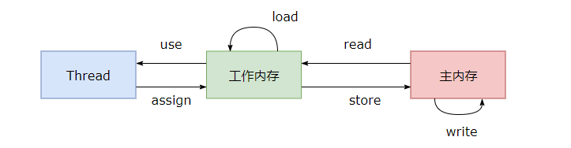

# 
JMM

### Java 内存模型

Java 内存模型（JMM）是一种抽象的概念，并不真实存在，它描述了一组规则或规范，通过这组规范定义了程序中各个变量（包括实例字段、静态字段和构成数组对象的元素）的访问方式。试图屏蔽各种硬件和操作系统的内存访问差异，以实现让 Java 程序在各种平台下都能达到一致的内存访问效果。 

### 主内存与工作内存

Java内存模型规定了所有的变量都存储在主内存中，每条线程还有自己的工作内存，线程的工作内存中保存了该线程中是用到的变量的主内存副本拷贝，线程对变量的所有操作都必须在工作内存中进行，而不能直接读写主内存。不同的线程之间也无法直接访问对方工作内存中的变量，线程间变量的传递均需要自己的工作内存和主存之间进行数据同步进行。

而JMM就作用于工作内存和主存之间数据同步过程。他规定了如何做数据同步以及什么时候做数据同步。

## 内存间交互操作

java 内存模型定义了 8 个操作来完成主内存和工作内存的交互操作 :

- read：把一个变量的值从主内存传输到工作内存中
- load：在 read 之后执行，把 read 得到的值放入工作内存的变量副本中
- use：把工作内存中一个变量的值传递给执行引擎
- assign：把一个从执行引擎接收到的值赋给工作内存的变量
- store：把工作内存的一个变量的值传送到主内存中
- write：在 store 之后执行，把 store 得到的值放入主内存的变量中
- lock：作用于主内存的变量，它把主内存中的变量标识为一条线程独占状态 
- unlock：解锁，作用于主内存的变量，它把锁定的变量释放出来，释放出来的变量才可以被其它线程锁定； 

### 内存模型三大特性

1. 原子性

2. 可见性

   可见性指当一个线程修改了共享变量的值，其它线程能够立即得知这个修改。Java 内存模型是通过在变量修改后将新值同步回主内存，在变量读取前从主内存刷新变量值来实现可见性的。JMM 内部的实现通常是依赖于所谓的内存屏障，通过禁止某些重排序的方式，提供内存可见性保证，也就是实现了各种 happen-before 规则。与此同时，更多复杂度在于，需要尽量确保各种编译器、各种体系结构的处理器，都能够提供一致的行为。

   主要有有三种实现可见性的方式：

   - volatile，会强制将该变量自己和当时其他变量的状态都刷出缓存。
   - synchronized，对一个变量执行 unlock 操作之前，必须把变量值同步回主内存。
   - final，被 final 关键字修饰的字段在构造器中一旦初始化完成，并且没有发生 this 逃逸（其它线程通过 this 引用访问到初始化了一半的对象），那么其它线程就能看见 final 字段的值。

   对前面的线程不安全示例中的 cnt 变量使用 volatile 修饰，不能解决线程不安全问题，因为 volatile 并不能保证操作的原子性。

3. 有序性

   有序性是指：在本线程内观察，所有操作都是有序的。在一个线程观察另一个线程，所有操作都是无序的，无序是因为发生了指令重排序。在 Java 内存模型中，允许编译器和处理器对指令进行重排序，重排序过程不会影响到单线程程序的执行，却会影响到多线程并发执行的正确性。

   volatile 关键字通过添加内存屏障的方式来禁止指令重排，即重排序时不能把后面的指令放到内存屏障之前。

   也可以通过 synchronized 来保证有序性，它保证每个时刻只有一个线程执行同步代码，相当于是让线程顺序执行同步代码。

   